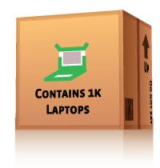
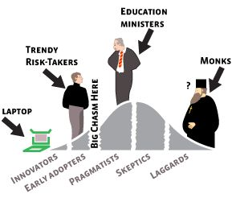
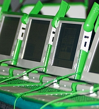

<figure class="float-right" style="width:50%">

</figure>

Hello I am [Alexandre Van de Sande](http://wanderingabout.com/), an interaction designer currently based in Rio de Janeiro, and in this first article I want to address a fundamental-in my opinion flaw in the OLPC strategy: distribution.

I don't think the One Laptop Per Child as a whole is doing well, there seems to be [no government buyers](http://www.olpcnews.com/sales_talk/countries/sales_inhibiting_xo_distribution.html), the production is being [constantly postponed](http://www.olpcnews.com/hardware/production/xo_laptop_production_delay.html) and the [XO's newest price](http://www.olpcnews.com/sales_talk/price/olpc_uruguay_205_dollars_laptop.html) is around US$200.

But is it really a two hundred dollar laptop that is being sold? At the minimum order of 250,000 computers Nicholas Negroponte is not in the business of selling cheap laptops, but of selling fifty million dollars in [untested education reform](http://www.olpcnews.com/use_cases/education/one_laptop_per_child_education.html).

There are of course good reasons for not selling the laptops individually or in the famous [buy 2 get 1 scheme](http://www.olpcnews.com/countries/usa/olpc_sales_plan_xo_laptops.html): first it's a logistical hell to ship and support. Nicholas Negroponte repeatedly said that half the cost of most laptops were marketing, shipping and support. But most importantly the laptop simply isn't as valuable alone as it's in a group of peers.

It's built up to mesh, to collaborate, to exchange information, to be learned and used within a community of similar laptops. A single laptop when living alone - or worst, when living surrounded by iPhones, Blackberries and Dell machines - becomes simply a cheap toy or an oversized PDA.

But there's a mid ground. It could be sold in radically smaller scale, in 1,000 laptops pack. Then it's not a $200.00 laptop but a $200,000 IT alternative. There are very compelling reasons why it should, maybe even that it must, be delivered that way, and that this decision must be made quick. At least 10 very good reasons:

**10. You can't expect the public sector from developing nations to solve anything.** Corrupt politicians that expect to get a cut of any multi-million dollar project they vote, slow democracies and short sighted policies: welcome to the third world, Nicholas Negroponte, where the government is part of the problem not the solution.

**9. You can't expect presidents from developing nations to keep their promises.** [Populism is a still alive](http://www.olpcnews.com/sales_talk/countries/bolivarian_pc_venezuela.html) in South America and Africa as it has always been. It's easy to get any president to pose for photos for the press, specially when they are holding a modern computer that they can [promise to give to his people](http://www.olpcnews.com/sales_talk/countries/bolivarian_computer.html).

But once he on front page, it's over. Populist presidents can see only so far as the next election, and when it comes to invest millions in anything they expect it to be easily understood and remembered to any uneducated voter.

That's why they will prefer to build a unprofitable, incoherent, hand built computer assembly line than to buy any computer from foreign countries. Factories equals Jobs, while sending money to US and Asia spells "evil capitalists".

**8. You may expect city councils and municipal powers to take action.** Contrary to state and federal governments, in the municipal scale, one enthusiast can make a project happen. City mayors are usually eager to find projects that can put their own city on the map, even if that means doing things nobody has ever done before.

Also, a thousand children and his families can represent five thousand voters, and that does make a difference in the next elections, specially if you promise to expand this one-school project to others when your term is ending. A couple thousand dollars is the just the scale they can afford: around the cost of a bridge, a new road or reforming a school.

**7. You certainly can count on non-governmental organizations and non-profits.** At this lower price point, it becomes affordable to seek alternative fundings. A NGO can amass such a small fortune with a few important donors, micro-loans, a online money raising or just from venture capitalists with a plan in mind.

**6. Expect the eccentric riches.** It may be ironic that the first confirmed buyer of the OLPC was [Carlos Slim](http://www.olpcnews.com/countries/mexico/olpc_mexico_carlos_slim_xo_laptops.html), the Mexican who became richest than Bill Gates, but it's not completely unexpected. Forward thinking billionaires like Slim, Jeff Bezos or Richard Branson or even companies like Google are known to spend huge amounts of money in projects that do not have a direct expectation to be lucrative.

It doesn't really matter if it's some grand plan, philanthropy or simply a way to leave a mark: that's how the new space race is being paid for. Lower the cost of a warm feeling in the heart and you can be certain that every unknown rich will be buying XO laptops for the neighborhood schools they grew up in.

<figure class="float-right" style="width:50%">

</figure>

**5. Technology has a life cycle.** A lot has changed in recent years but not this: breakthrough products still get in the market through the early adopters, and only then it will slowly take the mainstream.

The early adopters have the kind of personality that make them the perfect OLPC faithful: risk-takers, technology enthusiasts, eager to turn the education system upside down and get rid of old paradigms.

You know where you can find some early adopters? They are working as some liberal school director, as community leader or maybe even in charge of some risky but mildly funded government project. Guess where you can't find any: in the state department that is in charge of allotting billions of taxpayers dollars into a already tight education budget.

**4. Let others make the trial and error for you.** There isn't much criticism on the Children's Machine itself. But there is a lot in almost everything else. The contructivism, the UI, the curriculum, the "third world only" policy, even the concept of giving one laptop to every child has been scrutinized, and it's at least arrogant to suppose anyone really knows what's the ONE best solution for every community.

If the XO is a true open tool the process should be open also. Let the laptop be used in all countries, every kind of community, to be lent in libraries, given at random, sold by microfinance institutes, exchanged for good grades. The best practices will emerge, and the whole process will evolve.

**3. The thousand-laptop number is big enough to create a critical mass in any community.** In a school or community where are all one's friends are using a laptop then it's more probable that he will use the laptop as it was designed.

That is, he will learn Sugar from his peers, and will be able to use the native mesh network to play with the already installed softwares for playing music, writing collaboratively and share animations in Squeak. Give one XO to a single user in and in no time he will learn to wipe it clean, install an illegal copy of Windows 2000 and Office.

His experience of the whole OLPC program will be of a crappy processor running a pirated copy of an unsupported, insecure OS, with software that was designed less for students than for accountants. That's what we call second class online citizens.

**2. Selling at a couple hundred thousands, the logistics are kept to minimal.** No marketing is necessary as the kind of customer that buys such technology en masse is already aware of the OLPC program. Transport and shipping will be reduced to sending one container from Taiwan to somewhere in the world.

From that point the distribution to children, infrastructure and deployment rely in the hands of the clients – since they are the one with a plan. Support can be as simple as an laptop replacement - expect 5% of laptops to fail? Then build 1050 and wait.

<figure class="float-right" style="width:50%">

</figure>

**1. Finally: the laptop technology is hot. But won't be hot forever.** Remember how revolutionary was the [iPhone when introduced](http://www.olpcnews.com/prototypes/olpc/olpc_xo_vs_apple_iphone.html)? Today full screen phones are being announced every wee, zooming with two fingers became a cliché and even one tap scrolling - arguably the coolest feature - can be done on common softwares. It's a miracle that a product announced in early 2005 still gets media attention and woes it's users but how much longer can it keep pace?

Once flash-based laptops are commonplace, once the screen technology gets to the market and when mesh networking becomes more common, the XO will not stand out so much. And when [other multipurpose computers](http://www.olpcnews.com/sales_talk/competition/) and cell phones approach the sub $200 mark people will start opting for more conventional methods for their cheap laptop alternative.

It doesn't needs anyone to be better in all categories like [low power consumption](http://www.olpcnews.com/hardware/power_supply/), mesh repeating while off or 1-second sleep state switch. You can even argue that the XO was not the designed to be top of the line.

But state decision makers don't usually understand that much about technology anyway, all you need to tell them is that it's cheaper, it's black and that it runs exactly like every computer he always used. And the green dream machine is gone.
