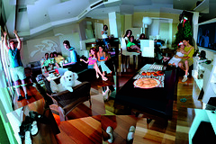

 
  [amigo oculto 19 dezembro 2003](http://www.flickr.com/photos/58994440@N00/38380596/)  
 Originally uploaded by [Alexandre Van de Sande](http://www.flickr.com/people/58994440@N00/). estava prometendo essa foto a um tempao aos meus amigos. Aqui está 
 
ela, uma montagem que fizdurante o amigo oculto. As pessoas que 
 
chegaram atrasadas (tipo a cissa) no entraram na sequencia de 
 
fotografias. Tem uma pessoas que aparece duas vezes. Duas pessoas na 
 
verdade. Tres se contar comigo. Primeira pessoa que sublinhar a juli 
 
ganha um prêmio. 
 
 
 
Como na época ainda nao tinha camera digital, sai pegando um monte de 
 
cameras emprestadas para tirar fotos o suficiente. Isso me custou até 
 
hoje, para os pais da fernanda que viram as fotos que tirei com a 
 
camera deles, a certeza de que o namorado da filha deles tira as 
 
piores fotos do mundo, com uma sequencia inacreditavel de fotos do 
 
ar-condicionado... 

<figure>

</figure>
