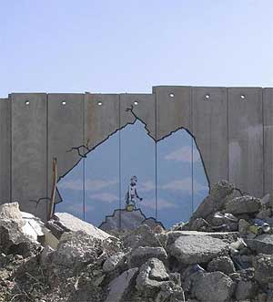
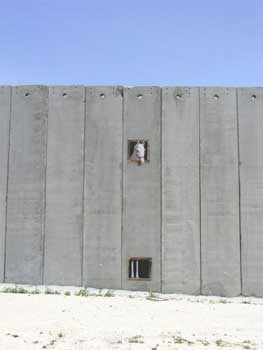
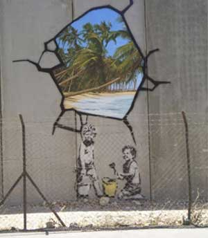

vcs que me conhecem sabem que nao gosto de nenhum artista pos moderno. Ja disse que nao considero seriamente nenhum artista vivo que se autodenomine como tal, certamente um exagero de quem nao esta por dentro do mundo da arte. O meu artista preferido da atualidade nao sei se se considera um artista ou não, mas ele brinca com a propria ideia de tal. Banksy, conseguiu colocar em um mesmo dia sua obra em todos os principais museus de nova york: o moma, o tate, o metropolitan, o brooklyn e até o museu de historia natural. Nesse caso, conseguiu colocar deve ser tomado no pé da letra: ele levou debaixo do braco, colou um quadro na parede e esperou para ver quanto tempo eles ficaram lá. Alguns dos museus depois de descoberta a farsa adotaram a obra para sua coleção. Mesmo os que retiraram as obras da parede dificilmente se desfizeram do presente. 
  
 Mas o mais interessante mesmo, que me levou a escrever isso foi a ultima exposicao dele em israel. Sendo basicamente um artista de paredes, nada mais natural que tenha ido no muro mais polemico do nosso tempo deixar lá oque ele pensava. 
  
  
 
 
 
  
 
 
 
  
 
 
  
 **Unwelcome intervention** 
 Banksy also records on his website how an old Palestinian man said his painting made the wall look beautiful. Banksy thanked him, only to be told: 'We don't want it to be beautiful, we hate this wall. Go home.' 
  
  
 [http://www.guardian.co.uk/arts/gallery/image/0,8543,-10105256016,00.html](http://www.guardian.co.uk/arts/gallery/image/0,8543,-10105256016,00.html) 

<figure>

</figure>

<figure>

</figure>

<figure>

</figure>
