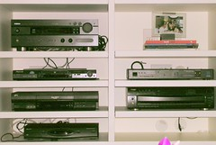

 
  [ligando o som](http://www.flickr.com/photos/58994440@N00/38367854/)  
 Originally uploaded by [Alexandre Van de Sande](http://www.flickr.com/people/58994440@N00/). voce sabe que o cd ficou obsoleto como mídia quando tem qe carregar um 
 
monte deles de um lado pro outro. Você sabe que tem alguma coisa em 
 
obsolecencia na sala quando a maneira mais simples de se ligar o dvd, 
 
em uma casa onde ninguêm é engenheiro ou algum geek de carteirinha, 
 
voce tem que passar por esse labirinto de aparelhos... 

<figure>

</figure>
