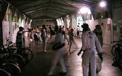

 
  [capoeira](http://www.flickr.com/photos/avsa/45621086/)  
 Originally uploaded by [Alexandre Van de Sande](http://www.flickr.com/people/avsa/). saindo da ensci. tem um curso de capoeira no patio. o professor explicando em portugues a importancia de se defender o rosto enquanto estamos gingando, com a marra de que voces nao ousem contestar minha lingua natal - e com uma crenca no fundo de que portugues bem falado é lingua universal. Os alunos com aquela cara de que entendiam bulhufas, mas que fazia parte da missa, aquelas frases em latim ou qualquer coisa derivada. 

<figure>

</figure>
