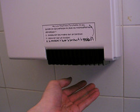

 
  [discussoes inusitadas...](http://www.flickr.com/photos/avsa/45621087/)  
 Originally uploaded by [Alexandre Van de Sande](http://www.flickr.com/people/avsa/). no aquecedor da escola. 
 
Impresso: Quem participa mais do aquecimento global? 1) enxugar as maos com um paninho 2) apertar um botao 
 
alguem escreveu a 3 opcao: a maquina de lavar o paninho/ e o caminhao pra transporta-lo 
 
um terceiro replicou (a seta puxando pra cima): nao se pensarmos localmente. A lavanderia da esquina. 

<figure>

</figure>
