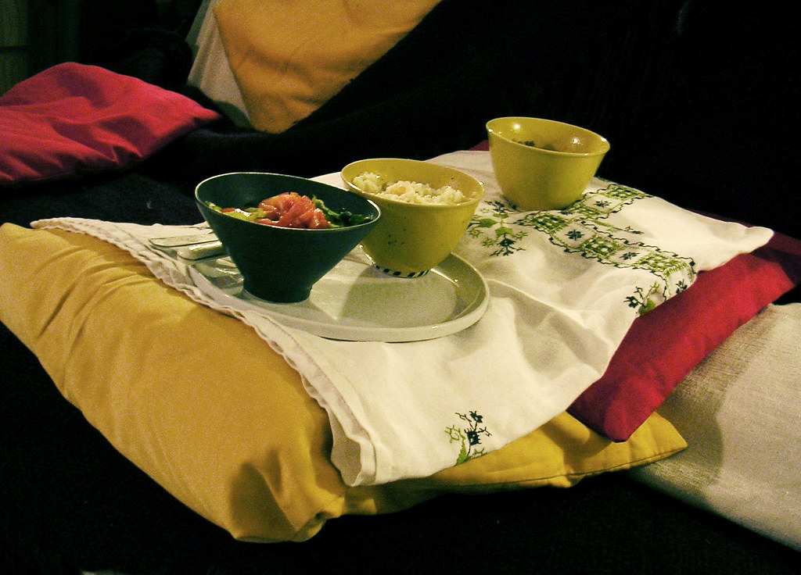

[Guia de cozinha para quem nao entende nada de cozinha (e por quem tb nao)](http://www.flickr.com/photos/avsa/47406920/) ja que o que faz sucesso mesmo é foto de comida ai vai. 1-ferva agua com sal e pique o alho

2-olhe o que voce tem a disposicao. Se for um pacote com um monte de coisas miudinhas, jogue na panela de agua

3-Se vier em pedacos grandes, jogue na frigideira com manteiga e o alho. 4-espere ate voce achar que esta bom. Enquanto isso, pegue folhas e mais tudo o que nao se enquadrar nas categorias acima, incluindo o alho se voce nao usou, lave pique, coloque em um pote e chame de salada. Coisas exoticas, tipo amendoin, frutas ou picles tornam sua salada exotica

5-Sirva. Regra geral de design: voce pdoe nao saber como tornar tudo gostoso, nesse caso faco o possivel para deixa-lo bonito, colorido e bem apresentado. Se possivel torne-os cheirosos e sonoros. Nossos sentidos sao uma otima intuicao de quando algo esta bom pra comer, ou pelo menos uma otima conspiracao para enganar o paladar que nem va notar que aquilo nao foi feito direito.

Recomendo deixar um bom livro de receitas abertos, com voce psicologicamente convencido de que esta seguindo uma delas. Qualquer uma, nao importa: voce nao vai ter metade dos ingredientes/utensilios disponiveis, entao de vez em quando olhar ele dizer "junte a cebola picada a panela ja untada" vai te deixar muito mais confiante.

Va com confianca e deixe bonito. Tem funcionado pra mim. Ah, e invente nomes bonitos. legendas de cada prato no flickr - clique na foto

<figure>

</figure>
