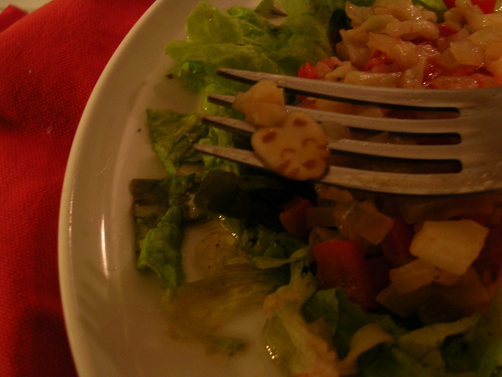

o tal miojo japones. Essa refeicao foi que nem sopa de pedra, que voce poe pedra, depois poe pimentao, doura cebola, alho, alface batata e ... tira a pedra. Nem sei se o miojo é bom mas a refeicao estava.

<figure>

</figure>
