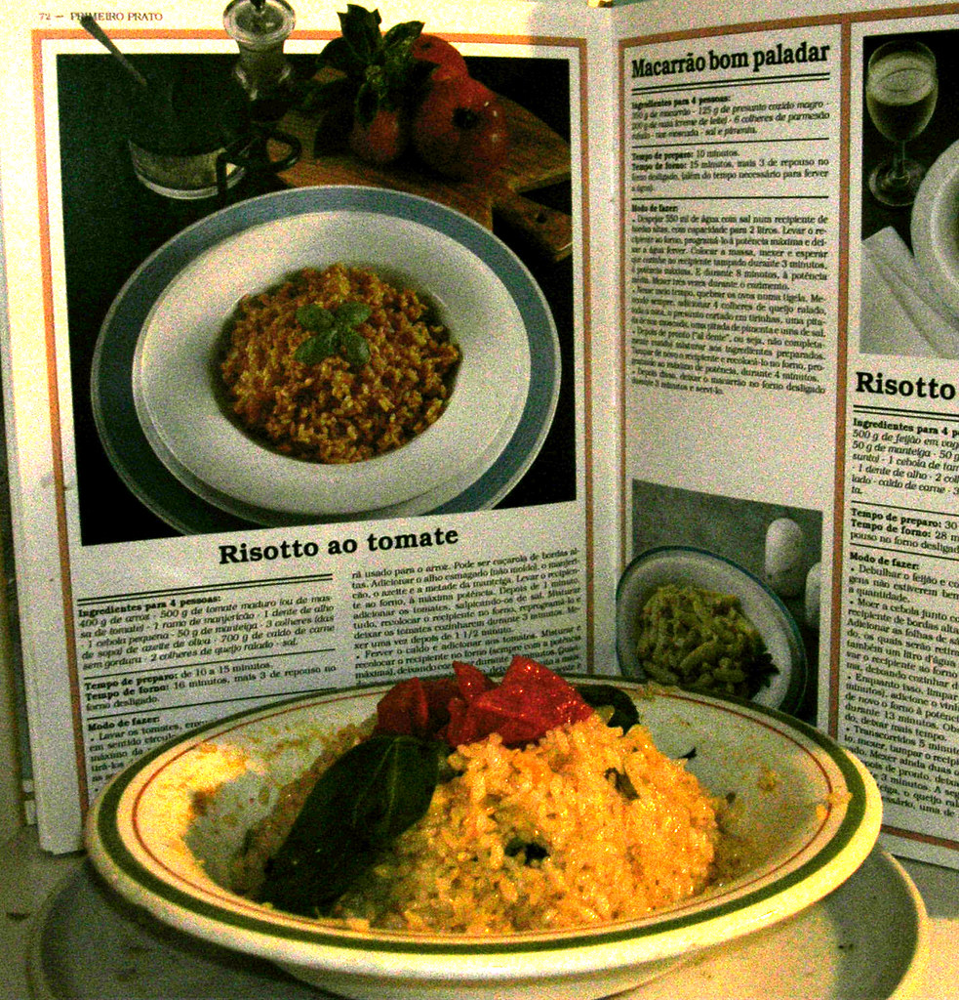

estreando o livro q a fe me deu, risoto todo feito com microondas, incluindo assr o tomate e cozinhar o arroz. Ah fala serio nem ficou feio... desculpem a luz, foi a unica foto q consegui tirar antes da camera acabar a pilha

<figure>

</figure>
