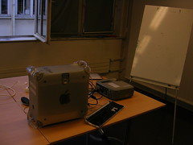

 
  [olha mamae eu com equipamento](http://www.flickr.com/photos/avsa/44653406/)  
 Originally uploaded by [Alexandre Van de Sande](http://www.flickr.com/people/avsa/). .. ai eu falei: beleza. Tinha uma coisa na manga. Quero uma sala um 
 
projetor e um quadro branco. Ai a moca me respondeu: tudo bem. Quer 
 
tambem um G4 -esse computador- a chave e a permissao pra ficar a noite 
 
toda ai se for preciso? 
 
 
 
é essa a diferenca de approach. Esse projeto eu nao poderia realiza-lo 
 
 (ou nao tao bem)se: 
 
1-nao tivesse esses equip a minha disposicao 
 
2-nao tivesse trazido minhas aquarelas e papeis especiais 
 
3-morasse ao lado e pudesse dar um pulinho em casa pra jantar e voltar ja 

<figure>

</figure>
