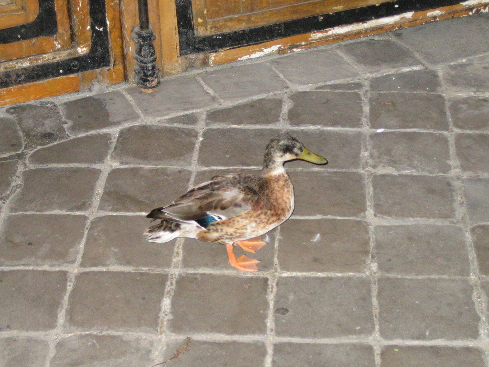

eu o egil estavamos saindo pela porta escura do boulevard e eu comentando: nao se preocupa nao tem ninguem escondido aqui. ai ligamos a luz para abrir a porta e eis que surge em nossa frente um pato. E quando olho para o gil para dizer o obvio atras dele tinha um gato, com uma cara que tinhamos frustrado o jantar dele. e enos encontramos assim, entre duas pontas da cadeia alimentar. E agoa? se saimos agora, o pobre pato vai ser devorado pelo gato. Mas nao podiamos pegar o pato e ele nao fazia questao de ir para a rua com a gente

deixo o gil cuidandodo pato e vou ver se por acaso um pato bonito daqueles nao pertenceria a algum vizinho. Logo junta-se uma outra vizinha que achava a situacao "assez bizarre" - e seu gato de estimacao que aproveitou a situacao para ir garantir a proxima janta. E foi se juntando outra vizinha, mais luz acesa, o tempo passando os gatos se armando e o pato la, parado, se deitando no chao em posicao de assado.

E se jogassemos um cobertor nele? E se, e se e se e dai? Entao nessa de conduzir o pato, pensando onde encontrariaos um lugar seguro para ele ele para em uma porta escrito guardiao. E na confusao do absurdo, usando a logica basica que aprendemos nos jogos e livros de crianca - pato - seguro- guardiao - surge a maior ideia de jerico da europa e abro a porta pro pato entrar.

Eis que sai o guardiao, extermamante puto por estarmos pertubando a paz de sexta dele por uma razao estupida "quest-ce que voulez-vous que je fasse avec un canard ?"

a voz da razao fala. desculpe guardiao, desculpe vizinhos, com licenca e boa sorte pro pato.

Que desapareceu sem deixar pistas, endereco ou penas como testemunha de sua saida. Ou sobra de jantar.

<figure>

</figure>
