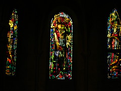

 
  [vitrais](http://www.flickr.com/photos/avsa/44659637/)  
 Originally uploaded by [Alexandre Van de Sande](http://www.flickr.com/people/avsa/). vitrais da basilica de st-pierre de montmartre. 
 
Me chamou a atencao um desenho tao moderno em uma basilica do sec 
 
XIII, mas depois o padre deu a dica, os vitrais sao de 1950. Agora 
 
sabendo disso inverto a impressao: nao parecem mesmo desenhos 
 
medievais? 

<figure>

</figure>
