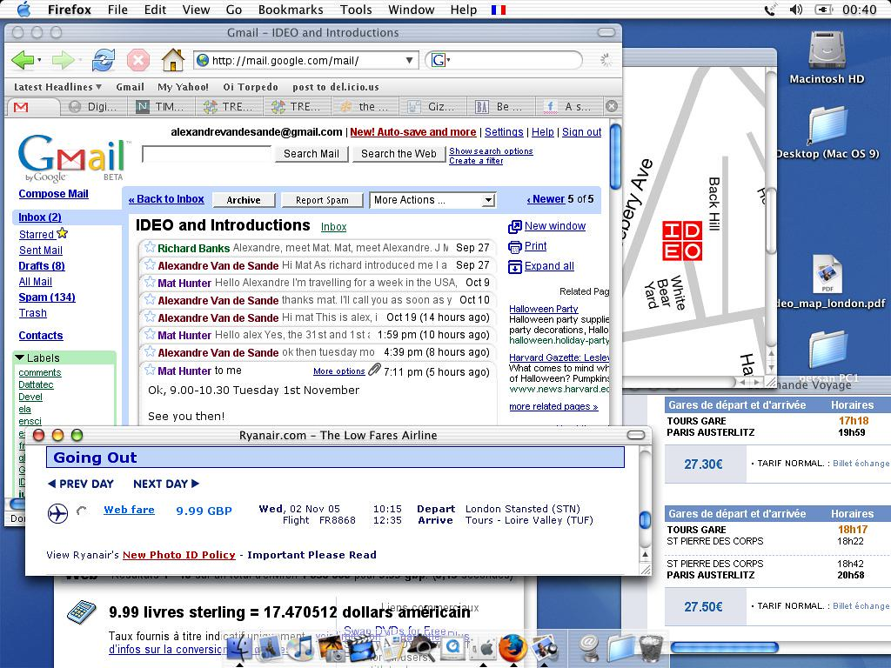

Mandei um email praquele cara que conheci naquele concurso, que me passou o email do sujeito que trabalha na mesma compania mas na ilha aqui em ciam que me apresntou ao tal designer que pediu que eu telefonasse na semana que vem. isso foi semana passada e a artitmetica da que isso era hoje. liguei pra ele meio sem jeito, tentando ser profissional e esquecendo de dizer good morning how are you. ai ele pediu que mandasse um email. mandei. ele mandou outro. cobinamos: vou pra la no fim do mes, quando temos um feriado prolongado de todos os santos com halloween. Mais detalhes em notas no flickr. alias vi dois portfolios inspiradores ontem, o tipo que queria ter. projetos simples, que fazem voce rir e depois pensar. de uma louisee de uma

ana . vale a pena ver. Fazem

muita coisa juntas. Da primeira vale a pena visitar o crimewire, uma solucao simples que aborda o problema da pirataria digital. Mas ao inves de tentar resolver esse problema complexo ela nos leva a pensar sobre a responsabilidade do individuo e o quanto a interface pode nos tornar conscientes do que estamos fazendo para o sim ou para o nao. Da segunda vale a pena ler as "istorias sobre a cadeira amerela", uma linda experiencia sobre as diferencas entre dividir objetos virtuais (como musicas ou internet) entre vizinhos e realmente dividir experiencias. Quem quiser clicar vale a pena, quem nao quiser continue lendo por que vou estragar um pouco da surpresa contando o final da historia e minha opiniao. O Crimeware é uma cara nova para o limeware um programa de download de arquivos bem popular. Ela comeca por coisas simples como trocar o botao "baixar esse arquivo" para "roubar essa musica". Depois parte para detalhes complexos como um historico que mostra nao so os seus ultimos arquivos baixados, mas o valor em dolar que voce deve as gravadoras, e o quanto voce deve aos artistas. Termina finalmente com um calculo divertido onde voce diz seu salario, quantos vinis fitas e cds voce tem em sua colecao, e ele diz o quanto voce pode "roubar" por dia sem peso na consciencia. Muito premiado. O segundo nao vou contar, pois so se compreende lendo o conjunto todo, que afinal o interessante nao é a experiencia mas as conclusoes dela sobre. A experiencia, se voce quer saber, é que ana, depois de ver que um monte de vizinhos usavam o wifi dela resolveu colocar uma cadeira na porta de casa e uma placa "minha conexao wifi esta disponivel gratuitamente naquela cadeira amarela"

<figure>

</figure>
