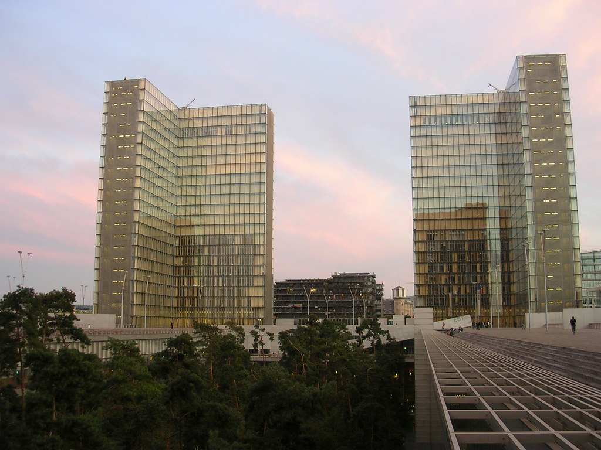

Domingo preguicoso esse. De manha-nem tao manha assim, sai para a feirinha daqui de perto. dei a sorte de encontrar a italiana minha vizinha na saida entao fomos juntos batendo papo. Depois passear por ai.

estava chovendo entao peguei o casaco da nanda para estrear. Ele era bem quente mas o melhor contra a chuva que tinha, pensei eu. Desnecessario dizer que no meio do caminho abriu um sol maravilhoso e eu fiquei carregando o casaco de um lado ao outro. Fui ate o marais que tinha um evento sobre revistas eletronicas, dentro de uma exposicao maior sobre revistas. nada demais.

Depois corri -passando por baixo, pela beira do sena - ate os invalidos, para conhecer a esplanada. Na grama gente fazendo com frisbee oque jamais imaginei que desse para. Chutando, repassando, acrobacia. Filmei, vai no proximo podcast. Voltamos a biblioteca francois miterrand, do outro lado de paris. Em 30 minutinhos com vento na cara estamos la. Biblioteca bonita, mas os parisienses nao gostam. Foi uma obra cara o bastante para se desconfiar, os lindo predios brilhantes e transparentes nao combinam com o ambiente escuro que os livros precisam, e o mini bosque de pinheiros no interior nao tinha profundidade o bastante para as raizes das arvores. Mas apesar disso, apesar dos fios segurando as coitadas de pe, a arquitetura é bonita. Fui para ver macunaima, mas esqueci que essa foi ontem e hoje era domingo. entrei e peguei o final de 'tenda dos milagres' que ate o final nao estava entendendo nada - cade mario de andrade nessa historia? Tudo bem, valeu pelo 'deus e o diabo' de graca que vi na sexta. Ano do brasil na franca é isso ai.

<figure>

</figure>
