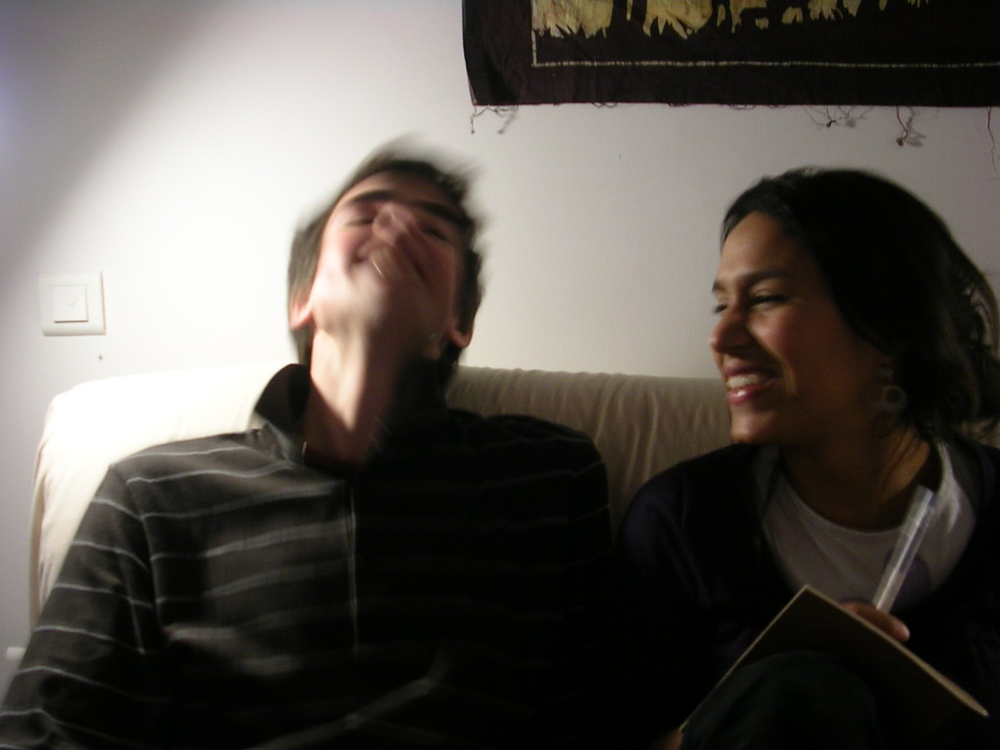

hoje convidei meu grupo para uma reuniao de trabalho aqui em casa, decidir o que vamos fazer para o curso de video "image de pensee". Um curso que imaginei ser sobre videomontagem e esta saindo mais para videoinstalacao. Meu grupo: clemont,frances, e maria, costa-riquenha. Mas eis que no meio da sobremesa- fiz comida pra eles aparece uma brasileira que estava na casa da vizinha. Assim essas loucas que vieram passar tres meses na europa e foram ficando. ai conheceu uma amiga, que chamou a prima, que mora aqui ao lado, que me apresentou a ela, a quem apresentei maria, que apresentou uma amiga que esta em paris, fala portugues e quer compania. Acho que nessa ela estende a estada em paris alguns dias. E no meio de tudo vem a outra vizinha, uma italiana a quem tinha emprestado uma bicicleta - ela voltava tarde do trabalho hoje- para me devolve-la. Foi divertido ter um monte de gente assim de repente na casa. E nao é que ate sairam boas ideias no final? Sobre imagem, movimento, e som.

<figure>

</figure>
