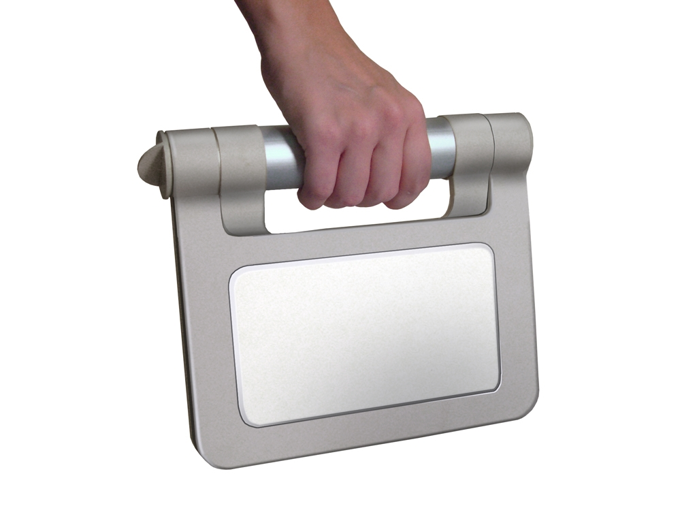

 

 Negroponte é o designer que mais respeito, por que é o unico que respondeu uma pergunta que sempre tive: se cada dois anos a potencia dos computadores dobram, por que nao podemos manter a potencia e ficar com metade do preco?

<figure>

</figure>

Ele foi um dos fundadores do media lab do MIT -precisa mais curriculo que isso?- e é a cabeca do projeto do laptop de US$100, uma cabeca que nao pensa pequeno cujo objetivo maior é fornecer um laptop para cada crianca do mundo. Esse projeto ja esta na midia faz tempo, mas o tal laptop foi mantido longe das vistas do publico. Ate essa semana.

O projeto é totalmente diferente do que vemos hoje no mercado. Posui uma tela de LCD de 7 polegadas (a largura de uma agenda de 15cm) com resolucao de 640x480. Nao tem disco rigido, em seu lugar tem uma memoria flash - essa compacta de cameras digitais- de 1 giga e tem um processador de 500Megahertz. No mercado, o padrao é de processadores de pelo menos um gigahertz, telas de no minimo 12 polegadas, e discos de media de 80 gigas, o que faz o laptop do mit parecer um anao se compararmos nos termos atuais.

Mas nao podemos compara-lo ao que esta ai e isso que é interessante. Ele nao so tem conectividade com internet, ele faz internet. Posui um modem a radio que cria uma rede P2P, transformando uma vila com um grupo de laptops em uma serie de servidores em rede que se pelo menos um deles possuir uma conexao a grande internet todos eles terao imediatamente.

O eixo de dobra nao é somente uma pega, mas como possui uma alca interna que pode servir para o garoto pendurar no ombro ou como tomada. E finalmente, caso nao haja nem energia eletrica, uma manivela em 30 segundos gera energia suficiente para pelo menos 5 minutos de ver emails.

O laptop funciona como celular (por VOiP), como e-book (a tela passa para preto e branco para economizar energia), e rodar quase qualquer coisa que um computador roda (office, jogos, editor de som, editor de imagens, editor 3d, talvez a unica excecao seja video, que exigiria mais memoria)

O laptop nao é uma simulacao, existe e é realizavel por esse preco. Uma versao comercial - incluindo custos de marketing e distribuicao- saira em seguida pelo dobro, para atender a demanda geral (e diminuir o problema dos primeiros serem roubados, ja que nao serao joias raras). Ha problemas de logistica de producao a serem enfrentados, mas o maior sao problemas politicos. Negroponte precisa de uma demanda inicial de alguns milhoes de exemplares, e brasil, egito, china e thailandia ja se mostraram interessados. Mas uma coisa é se mostrar interessados.

No brasil, o MIT vai encontrar um pais em anos de eleicao, o encontro com o lula foi para o pt so mais um desses momentos divertidos onde o lula posa para os fotografos segurando alguma coisa: se houvesse um chapeu do MIT o nosso presidente certamente teria aparecido na primeira pagina do globo com ele. O governo atual mostrou que o pt - e o pcb, o pl etc- nao tem capacidade de organizacao para assinar um cheque de cem milhoes de dolares para nada, apesar de que, somando as mesadas, os bolsa-esmolas, os avioes, e todos esse pequenos agrados chegarem a um valor talvez maior que esse. E dos outros candidatos nao acredito que Cesar Maia, Aecio Neves ou -valhamedeus- garotinhos tenham qualquer interesse em "qualquer qualquer plano de educação que vá representar uma ameaça de democratização do ensino".

A china, aquele pais que gostamos de esquecer que é a maior ditadura do planeta, ainda usa o poder censor do estado contra blogs que usem palavras como democracia em qualquer contexto. Por mais que tenha interesse em educar sua populacao e poder de fogo para comprar um bilhao de laptops, nao cai aceitar facilmente um aparelho que pode criar um internet independente, descentralizada, incensuravel e incontrolavel. Infelizmente um motivo que parece o acima citado do brasil. Nao conheco a politica dos outros paises, mas se seus politicos tivessem uma visao progressista, interesse em dar educacao e preparar o povo para o futuro, certamente nao estavam onde estao.

As boas novas é que Negroponte é alguem muito inteligente e nao esta sozinho. Por tras dele interesses de gigantes como google (que com um projeto que torne a internet universal torna-se finalmente mais importante que a microsoft), AMD (repito a ultima frase) e AMD (repito a ultima frase, com intel no lugar de microsoft). E uma vez que o projeto esteja feito, certamente clones ou oficiais vendidos pela dell, um pouco mais caros haverao de aparecer no mercado com precos ligeiramente maiores. Se um laptop desses por R$300 pode parecer impossivel, um similar por R$1000 financiado em 10 vezes, pode fazer uma revolucao similar.

John negroponte esta determinado a fazer isso acontecer. Ele, um homem que tem tudo o que quer, nao esta interessado em tornar-se milionario. Mas se conseguir, significa que tera democratizado o acesso a informacao e educacao, democratizada ferraments de trabalho que podem globalizar oportunidades do mundo, e ele estara na lista dos 10 nomes mais importantes desse novo seculo. Como o cientista que salvou o mundo. Todo dia morre um abdulah que nao deixou mais do que um playground de um bilhao de dolares para os netos.
