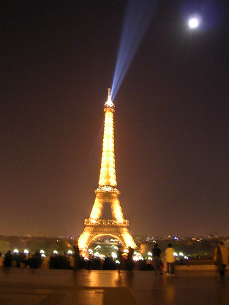

 
  [sabado noite](http://www.flickr.com/photos/avsa/53138084/)  
 Originally uploaded by [Alexandre Van de Sande](http://www.flickr.com/people/avsa/).  
 
Ontem a noite depois de ver meus emails fui para o trocadero encontrar 
serge e catherine que iam me dar o ja prometido faz tempo tour por 
paris. de carro. Gostoso, bonita a torre de noite bem de pertinho. 
Invalidos, vai e volta por lugares que ja inha passado a pe e por 
bicicleta, mas que de carro é outra coisa. E eles iam me contando as 
historias, especialmente da arquitetura de paris, que essa é a 
profissao deles. 
 
Os arcos em frente ao louvre foram da epoca do napoleao. O resto, de 
30 anos depois que ficou na moda. Os quatro apoios da ponte dos 
invalidos sao estruturais (ja postei essa foto? tem 4 estatuas 
brilhantes) é assim o: a ponte é de ferro e tem de ter uma curva 
invertida para aguentar o peso do vao central. Entao para segurar a 
pressao lateral, do ferro querendo se estender, voce tem de colocar 
quatro pesos nas pontas, como pregos para segurar a ponte no lugar. 
Simples né? Bonito de saber. 
 
 

<figure>

</figure>
