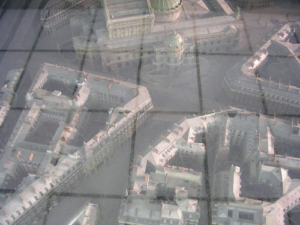

 
  [Sabado](http://www.flickr.com/photos/avsa/53133722/)  
 Originally uploaded by [Alexandre Van de Sande](http://www.flickr.com/people/avsa/).  
 
 
Sabado ultimo dia do rodrigo. Fomos ao museu d' orsay e dali nao 
saimos, ao contrario do que planejavamos. O d' orsay cobre arte mais 
ou menos de 1830 (onde acaba o louvre) ate 1910 (comeco do pompidou). 
Basicamente impressionismo sim, mas tb arte nouveau, umas estatuas 
etc. Alias as estatuas desse periodo sao muito mais emocionantes, elas 
nao tem a pompa das da antiguidade (venus em pé), a soberba do 
renascimento (venus em uma pose dificil dancando com marte e segurando 
cupido), a religiosidade pesada do barroco (maria sofrendo com cristo 
morto) e nao foram ainda para o simples abstrato do moderno - ou 
conceitualismo do pos (respectivamente 'escultura ortogonal vermelha 
numero 15' e 'a morte insana de jesus na infancia - isso é, boneca 
derretida na cruz') 
 
ao inves disso sao esculturas realistas sim mas com temas mais banais, 
como crianca brincando, ou guerreiro com arco e flecha. especialmente 
um duo, "eva antes do pecado" e "eva depois do pecado" me fascinaram 
bastante. Enquanto a primeira era uma imagem bem ingenua de uma ninfa 
feliz e apaixonada, a segunda era uma mulher em uma pose contorcida de 
preocupacao, as pernas pesadas, os bracos fechados, a mao segurando a 
cabeca e um olhar - nunca vi uma estatua com um olhar tao forte - um 
olhar de que pensava, quase arrependida, em todas as consequencias do 
que acabava de fazer 
 
e umas maquetes ao fundo, em destaque uma maquete da regiao em volta 
da opera de paris. Por que? Por que esses predios foram feitos nessa 
epoca oras, entao estava incluidos na mostra

<figure>

</figure>
