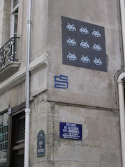

 
  [Space invader - Rue de Poitou](http://www.flickr.com/photos/avsa/52416994/)  
 Originally uploaded by [Alexandre Van de Sande](http://www.flickr.com/people/avsa/). Esses sao umas intervencoes urbanas em paris. O grafitti mais interessante que ja vi, ele cola placas de azulejo, e aproveita uma caracterisitica da propria midia para criar um estilo. Estilo atari. 
 
Bem, espero que esses posts meio que compensem as duas semanas de silencio 

<figure>

</figure>
