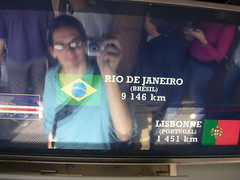

 
  [ta longe nao é?](http://www.flickr.com/photos/avsa/56116905/)  
 Originally uploaded by [Alexandre Van de Sande](http://www.flickr.com/people/avsa/). essa foto é da epoca que o rodrigo estava ai ainda. tem outra mostrando a 
 
vista, queria colocar as duas juntas mas estou sem photoshop aqui. mostra a 
 
vista em linha reta pro rio. 
 
 
 
dia normal. nao evolui muito em relacao a encontrar onde ficar em londres, 
 
vou ter de me contentar com o albergue a 12£ mesmo. Mas a passagem esta 
 
marcada, nao tem volta :) 
 
 
 
primeira aula do dia a aula de video filosofica. nao conseguia prestar muita 
 
atencao por que nao parecia muito interessante. Estava com a cabeca distante 
 
dali. Ai o clemont comecou a falar de podcast para o professor (eu que 
 
apresentei ao clemont, sou incuravelmente chato nao é?), que dai o assunto 
 
foi para blogs e dai para aquela velha ladainha de tres anos atras como 
 
blogs sao so diarios intimos com nenhum conteudo e que sao uma moda 
 
passageira. Entrei: eu descobri por que em geral quando eu discuto as 
 
pessoas me chamam de chato, é por que detesto quando o assunto nao segue 
 
tema nenhum. Ai eu sempre dava um jeito de voltar ao tal ponto, sobre a 
 
futilidade x utilidade de dar ferramentas de comunicacao pra qualquer um. No 
 
meio do assunto me ocorreu que talvez fosse eu, do meu modo, querendo trazer 
 
o assunto para o meu lado, falar do que eu queria, um forma de nao deixar a 
 
conversa fluir. Ai ela fluiu, e foi para o professor falando de como as 
 
pessoas tem de ter respeito por toda a historia do cinema antes de sair 
 
clicando com uma camera digital, o outro falando de como a televisao faz com 
 
que as pessoas nao se interessem por coisas serias (a triade "eles" versus 
 
"a massa" contra "as coisas serias"). No fundo sairam coisas interessantes 
 
sim, mas nao se chegou a conclusao alguma. resultado: errado eu que fico 
 
achando que se tem que chegar a conclusoes 
 
 
 
aula do atelier numerique uma conversa boa com a professora. mostrei coisas 
 
para ela, ela me mostrou outras, me mostrou como boa parte das nossas 
 
primeiras ideias (sempre) sao coisas que estao sendo pesquisadas ja ha algum 
 
tempo em varios laboratorios. prova que a ideia é boa. prova que ler mais e 
 
mais nunca é demais. 
 
 
 
a noite estava tendo um risoto de despedida na casa das italianas. Duas 
 
italianas, uma francesa, um alemao, um algeriano e o brasileiro, cada um 
 
chegando em uma hora. As italianas iam para a italia, o algeriano estava no 
 
ramadam e portanto ja tinha comido pontualmente as seis e meia, nao podia 
 
tomar vinho nem comer salsicha, mas era bem divertido. O alemao ia para o 
 
mexico encontrar a namorada distante dele - viu como é até bem comum - a 
 
francesa nao ia a lugar algum. finalmente o frances, que chegou depois meio 
 
bebado mas alegre, esse nem sabia pra onde ia. E o brasileiro voltou pra 
 
casa, para ver os emails dele e tentar ter noticias do brasil. (mas nao teve 
 
muitas nao...) 
 
 
 
e comprei uma couve. mas nao de comer... 

<figure>

</figure>
