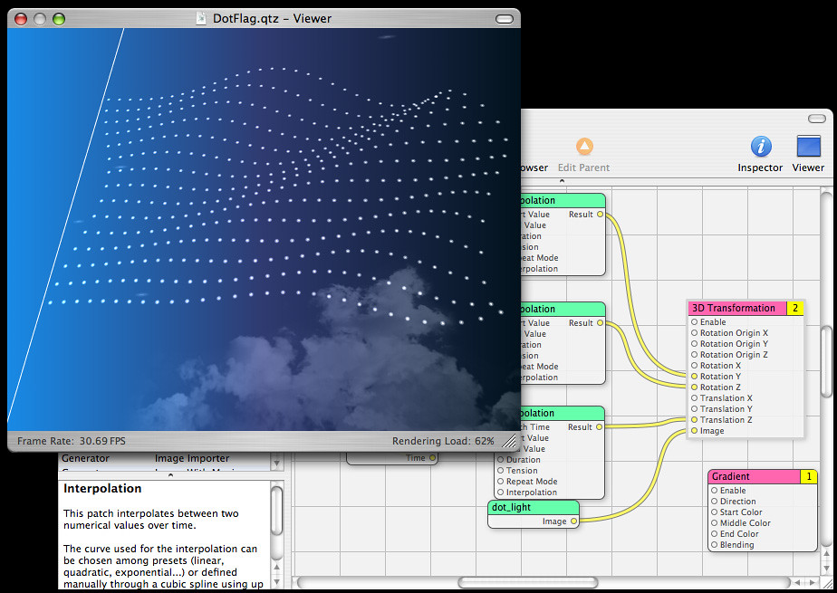

Ontem eu e gil estavamos brincando com um componente do osx, o sistema operacional que roda no laptop dele. E em praticamente todos os computadores da franca. O que gosto desses tai produtos da apple é que eles me fazem sentir que o computador pode mais. Ou que eu posso mais. Todo mundo fala que os programas sao simples e faceis de usar, eu concordo em parte. Muitos dos aspectos que acho simples sao por que ja me adaptei ao modo de pensar dos macs, da mesma forma como nos acostumamos com os pcs. O computador fica mais poderoso pela facilidade com que voce acessa suas musicas, edita videos e mexe em fotos todo mundo diz. Agora o interessante sao coisinhas pra gente que nem eu, que mexe com coisas do fundo do computador, que gosta de experimentar com o que o computador oferece. Gente que detesta programacao. O componente que descobri e mostrei ao gil, nossa cachaca dos ultimos dias, foi quartz composer, uma ferramenta que permite que voce use a capacidade grafica tridimensional do tiger, com tipografias em movimento no espaco, com blur, com imagens de varios niveis de transparencia, tudo interagindo com o som do microfone, com video, com musica, com a ultima noticia do jornal o estadao. E tudo sem linhas de codigo, mas plugando linhas em caixas de um grande diagrama funcional. A primeira vez que ouvi falar de "visual" basic achei que fosse isso, programar sem programar. fiquei decepcionado quando descobri o que era. Tinha 12 anos: eu sempre fui nerd né?... prometo que a proxima foto nao vai ser outro pirntscreen O meu tema no projeto kenwood é a forma de comprar musica de alguem que esta fisicamente proximo de voce, em um mundo sem suportes fisicos. vai ser divertido. Algo como a cadeira amarela. Mas eu sei que ninguem leu a historia da cadeira amarela mesmo :)

<figure>

</figure>
