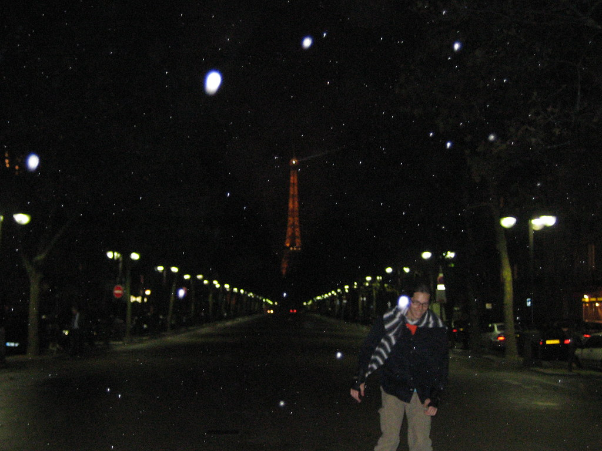

ontem foi um programa alternativo. o sergio encontrou uns velhos patins no sotao e me emprestou. O gil foi atras de bicicleta. Nem lembrava se lembrava como se andava. Na verdade andar nunca me foi um problema, parar que era. Mas em patins, ao contrario do carro, os postes sao seus amigos. Fomos ate a bastilha, entao aos invalidos, pelo sena. Dai ao museu rodin, onde ficamos so no jardinzninhos por que ja ia fechar - como tudo fecha cedo, as cinco horas!. Mas deu agua na boca pelo resto do, nem tao grande, museu. Expulsos do museus, fomos ao montparnasse, onde a yael, da esdi, estava filmando um material para seu projeto final. Ficamos la pelo 15, literalmente do outro lado de paris, ate anoitecer, e depois voltamos, com medo de ficar tarde, e de pegar muita chuva. Que pegamos mesmo assim. A volta foi passando pela torre, que nao é caminho. Mas vale a pena o desvio para ve-la de noite brilhando. E o sena, ate a bastilha, o caminho que tentei fazer no primeiro dia, mas que nesse dia a unica rodinha que tinha era da minha mala.

Uma vez, em um restaurante da lapa, convidados inesperados de uma figura do copyleft do rio, conversei com um barbudo meio bebado - mas legal - sobre paris. Eu ia, ele ja tinha ido. Me falou:

-cada cidade tem uma velocidade ideal. Brasilia se ve de carro, paraty, a pé. Paris é a cavalo. Ou na falta dele, bicicleta ou patins

<figure>

</figure>
