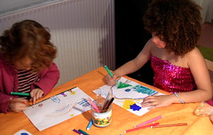

 
  [aniversario da emma](http://www.flickr.com/photos/avsa/65286447/)  
 Originally uploaded by [Alexandre Van de Sande](http://www.flickr.com/people/avsa/). emma é a menina que faz aniversario, que esta a direita na foto e quem 
 
tenho encontro marcado duas vezes por semana para levar, ela e seu 
 
irmao mais velho para casa. Era nesse aniversario que passei a tarde do 
 
domingo, ajudando helene. Madeleine foi uma crianca que chamou a 
 
atencao desde o principio: a unica que nao quis se fantasiar, a que 
 
brincava mais sozinha, a unica sem maquiagem, vestido ou longas 
 
trancas. Com seus cachinhos nem muito grandes nem muito curtos, ela 
 
tinha a ambiguidade assexual de um anjinho, desses que nao sabemos ao 
 
certo se é menino ou menina. Na hora do bolo, ela estava chateada, com 
 
algo que ninguem conseguiu entrar em seu mundo para entender, e ficou 
 
ao menos uma hora, sentada num canto do sofa pula-pula, choramingando 
 
com a parede sua incompreensao, se recusando a falar com quem se 
 
aproximasse. Mas entao todas as amiguinhas ficaram preocupadas e uma 
 
subita revoada de anjinhas a rodeou, pulando no sofa pula pula, 
 
dancando, se abaixando com aquela curiosidade de crianca e perguntando 
 
como um coro de grilos repetitivos "quesque cest qui il y a 
 
madeleine?" "quesque cest qui il y a madeleine??". Ai aos poucos a 
 
madeleine foi se deixando contagiar e levantou-se para correr pular e 
 
participar do concurso de desenho, do qual todas sairiam com primeiro 
 
premio. Mas achei tao curioso que ela desenhou logo uma casa uma flor e 
 
uma pessoa que pensei o que um psicologo diria do seu teste de HTP, que 
 
significado daria a sua House, seu diagnostico definitivo sobre a Tree 
 
e de como interpretaria seus Persons (ela e o irmao). Mas sob todos os 
 
aspectos, parecia o desenho de uma saudavel e alegre madeleine. Zoom do 
 
desenho no flickr 

<figure>

</figure>
