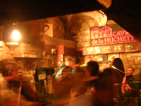

 
  [bar de jazz](http://www.flickr.com/photos/avsa/65273341/)  
 Originally uploaded by [Alexandre Van de Sande](http://www.flickr.com/people/avsa/). o sergio, primo distante (post sobre ele em seguida) esteve aqui. Ele 
 
estreou a parte de entertainement do meu lonely planet, a qual eu 
 
estive evitando por se tratar de uma longa serie de tentacoes para se 
 
sair a noite e gastar euros (mais sobre isso em seguida). Esse era um 
 
bar de jazz, ex taverna medieval, ex casa de nobres, ex camara de 
 
tortura de revolucionarios, um bar apertado com escadas que descem 
 
(paris tem mesmo um talento para o subterraneo) corredores que se 
 
descobrem. A musica nao estava tao jazz quanto o sergio queria, mas eu 
 
me diverti ao som dos beatles com um ritmo "jazzy". 
 
 
 
Eu decidi evitar o flash o maximo possivel. Nao gosto de suas 
 
distorcoes de cores, apesar de admira-lo por melhorar o foco de uma 
 
foto que nao precise de meio segundo para ser batida. estou praticando 
 
apoiar a camera (foi assim que tirei as fotos das catacumbas com 
 
iluminacao lateral sem que parecessem pedrinhas xoxas que o flash as 
 
transforma). Em compensacao essa foi a melhor foto da noite no bar. E 
 
nao tirei fotos das duas meninas impagaveis que conhecemos, duas 
 
londrinas fanaticas por anos 60, que se vestiam e tinham o cabelo 
 
naquele estilo que lembra donas de casa em anuncios felizes de 
 
asporador de po. Aprendi com elas a diferenca entre o swing e o twist, 
 
o segundo tendo vindo antes e permitindo uma danca mais solitaria, 
 
segundo elas disseram logo antes de se levantar para ir embora dancar 
 
(e nos irmos embora pois o sergio nao aguentava mais beatles) 

<figure>

</figure>
