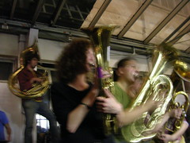

 
  [festa de quinta](http://www.flickr.com/photos/avsa/63383441/)  
 Originally uploaded by [Alexandre Van de Sande](http://www.flickr.com/people/avsa/). festa na ensci. Tive duas primeiras impressoes sobre os franceses: uma 
 
de que eles nao fumavam tanto quanto me disseram, outra de que eles so 
 
ouviam umas musicas eletronicas ruins. NA ultima quinta, comemoracao 
 
de vespera do feriado do fim da primeira guerra (para eles foi mais 
 
marcante que a segunda), mudei essas ideias. Depois da musica 
 
eletronica, ruim, veio um grupo de bandinha ("fanfarre"), dos mais 
 
empolgados que ja vi. A musica nao parava, tinha intervalos para uns 
 
respirarem, enquanto a tuba ou a bateria (portatil) mantinha um ritmo 
 
e preparava a proxima musica, que entrava tres segundos depois. E os 
 
franceses e as francesas (depois que ja tinham bebido) dancaramm, e 
 
dancam bonito. Dancam em casais, qualidade que sempre admirei, e sabem 
 
se remexer em qualquer musica, as vezes num movimento baguncado mas 
 
desses que encaixam, as vezes naquele jeitao fingir imitar um tipo de 
 
danca. Acho que o segredo é esse, vc finge que esta dancando twist, 
 
imita os passos de brincadeira, e vc esta de verdade. Tentei puxar uma 
 
amiga minha para treinar (sou o tipo de cara que sempre quis saber 
 
dancar com a namorada, mas sempre fez feio). Fiz feio. Acho que vou 
 
ter de puxar a esposa para fazer danca de salao quando completar 38: 
 
sou um caso perdido 

<figure>

</figure>
