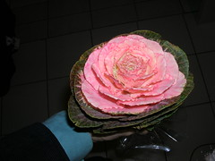

 
  [hoje](http://www.flickr.com/photos/avsa/59987668/)  
 Originally uploaded by [Alexandre Van de Sande](http://www.flickr.com/people/avsa/). foi numa feira, que estava atras de tulipas e encontrei essa. uma mulher 
 
meio maluca veio me falar sobre nao sei o que de nao ter promocoes e eu 
 
aproveitei e perguntei sobre flores, ela nao entendeu e falou mais de 
 
promocoes. parece ter um ditado onde "comprar flores" "procurar rosa" ou 
 
algo assim significa "encontrar um bom preco". homenagem ao dia de hoje. 
 
depois vem mais foto de londres. 

<figure>

</figure>
