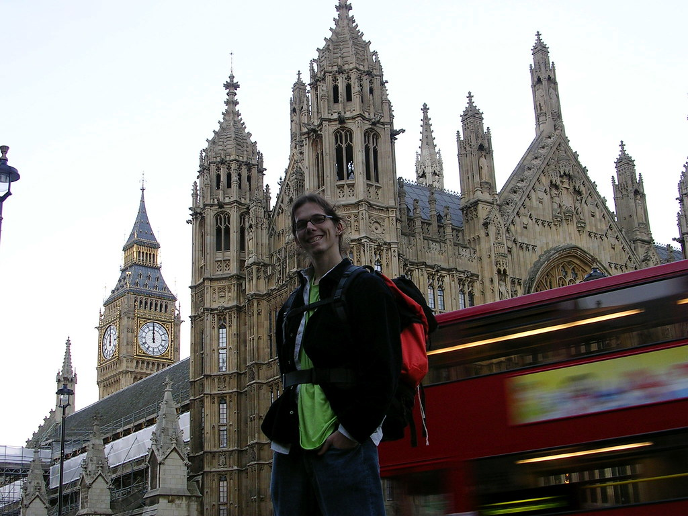

uma das diferencas que gostei de londres foram os museus. Nao entendam mal, o louvre tem uma curadoria impecavel, organizam e mostram de forma qause perfeita o seu conteudo, mas o british (e a national gallery) dao um passo alem. O british parece um livro aberto, com ilustracoes tridimensionais na sua frente. Enquanto o material grafico do louvre -so pra toma-lo como exemplo- descrevem suficientemente o que voce bai ver, no british me dava a impressao que na verdade eles eram o destaque, e que os objetos eram a ilustracao. Na pratica significa nao somente generosos cartazes, mas mapas, ilustracoes, infograficos contando a historia da epoca, replicas modernas da espada enferrujada para mostrar como ela devia ser na epoca, ensinando aquela materia, falando sobre a origem da escrita cuneiforme que alias, voces podem ver um exemplo na vitrine seguinte.

Algo que me chamou atencao e ilustra bem isso foi um cartaz grande falando sobre o codigo de hamurabi e suas implicacoes historicas. Procurei e nao vi sequer um mini-codigo de hamurabi, um pedaco e granito ou qualquer pedaco do rei da babilonia: ele estava la por que aquela secao falava de tabuas de leis nas civilizacoes antigas, e o codigo de hamurabi é a maior referencia indispensavel. Ao vivo, no british, tinham somente alguns pedacos de argila da persia, mas ou menos da mesma epoca. Quem quisesse saber mais estava la no final da explicacao "o codigo de hamurabi se encontra exposto no louvre, paris". Fiquei com isso tao na cabeca que aproveitei a tarde de hoje pra ver o tal la no louvre.

Outro exemplo sao os "explorer's packs" ou seja la como o pessoal de marketing chamou. Sao kits e roteiros de atividades para o pai transformar a visita do filho pequeno em uma aventura. Na national gallery vi um livro desses, e o pai sentava e ia lendo "esse quadro de um sujeito que vestia o rei. observe a palmeira, voce ve algo de curioso?". No british, era uma mochila completa de brinquedos, a la explorador egipcio. Vi um outro pai tambem, esse no salao dos sarcofagos, fazendo uma brincadeira com o filho que tinha que adivinhar de olhos vendados qual era o hieroglifo que ele estava tocando (obviamente uma replica que vinha no kit). Super interessante. Pra quem quer saber as respostas, a palmeira da india tinha sido pintada como uma arvore inglesa. E o garoto pegou um ankh. ps1. a foto nao tem nada a ver, é por que gostei dela ps2; esqueci de comentar: a flor do ultimo post era um repolho asiatico. Isso mesmo um repolho, era impossivel de nao reconhecer pelo cheiro quando arranquei umas folhas. foi isso que no outro dia chamei de "couve que nao se come", confundi couve com repolho ps3: valeu por todo mundo que me mandou mensagem perguntando se eu tava bem, por que leu nos jornais sobre as revoltas nos suburbios. eu estou bem, e tb, como voces soube delas pelos jornais. Os tais suburbios sao cidades a parte na ile-de-france longe do circulo de conurbacao do centro de paris. A vida no centro nao se altera em nada (tudo bem que tem que selvar em conta que eu tb, como estudante estrangeiro de design, nao estou tao afinado com a vida diaria do parisiense, que afinal nao leio le monde nem liberation). Nao digo que essas revoltas nao sejam graves ou que os jornais exagerem, mas é interessante ver como nao alteram a rotina ou sequer o papo do parisiense como por exemplo as guerras entre os traficantes alteram a nossa rotina ou dominam as nossas conversas no rio.

<figure>

</figure>
