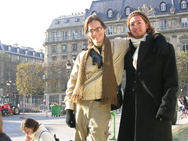

 
  [sergio](http://www.flickr.com/photos/avsa/65280289/)  
 Originally uploaded by [Alexandre Van de Sande](http://www.flickr.com/people/avsa/). a principio eu achava que nunca o tinha visto. afinal eu so o vi uma 
 
vez, bem antes da epoca onde me considerava gente pensante. E engracado 
 
considerar familia uma pessoa da qual voce sabe tao pouco. Mas 
 
dividimos muita coisa em comum, alem de um bisavo belga e uma avo que 
 
tinha uma irma gemea. As avos irmas gemeas dividem muito de sua 
 
historia, foram para a africa, se casaram com o melhor amigo do 
 
namorado da irma. Eu e o sergio temos uma mae que foi criada no congo, 
 
lavada a belgica e fugiu para climas mais quentes. A dele para o 
 
mexico, a minha para a bahia. Ele tem um irmao mais novo que da 
 
preocupacoes a familia pois ele quer seguir como musico - culpa do 
 
sergio que plantou a vontade ;) . Eu tenho um, mais velho e que a mim 
 
ja nao da mais preocupacoes - acho que o garoto esta encaminhado ;) . 
 
Uma fez astrologia, a outra da aulas de meditacao. As duas fizeram 
 
psicologia, apesar da dele ter feito muito mais tarde. E as duas 
 
planejam se aposentar em buzios. O sergio tambem resolveu ir a franca 
 
fazer intercambio da faculdade. Ele engenharia, eu desenho industrial. 
 
mas ele ficou mais tempo, alguns anos nessa, intercambio somado com 
 
estagios. Ele tambem atrasou em um ano o diploma para isso. Ele tem 
 
(tinha) uma namorada bonita (miss mexico, mas virou bem depois que eles 
 
terminaram). Eu tenho (tenho) uma linda. 
 
 
 
Nos demos bem. O sergio sabe se divertir, mas isso tambem significa 
 
saber gastar, e em dois dias gastei o que da em uma compra da semana. 
 
Na primeira noite andamos pela bastilha, paramos em um bar e 
 
discutimos, honestamente, sem forcar a barra, de arte moderna durante 
 
algumas horas. Ele sabia tanto ou mais de paris do que eu, e me dava 
 
algumas aulas enquanto passeavamos. No dia seguinte de manha fomos as 
 
catacumbas, nos separamos a tarde e nos a noite fomos ao tal bar de 
 
jazz do qual ja falei. Na manha seguinte deu para aproveitar a feira de 
 
sabado para o cafe da manha, e andar pelo marais enquanto ele ia para o 
 
museu picasso e eu matava o tempo antes de ir fazer baby sitting. 
 
Chegamos cedo no museu, e na vontade de prolongar um pouco o papo 
 
caimos em uma feira de "gastronomia, vinhos e frutos do mar" e de la um 
 
chocolate quente em um cafe bem interessante (citei que ele é gastador? 
 
mas sabe faze-lo bem). A conversa flui bem, foi divertido, 
 
interessante, esclarecedor. No final sentia que tinha sido bom 
 
reencontra-lo, apesar de na pratica, nunca nos vimos antes... 

<figure>

</figure>
