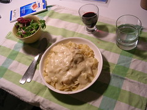

 
  [sutilezas dos extremos do mundo](http://www.flickr.com/photos/avsa/66318059/)  
 Originally uploaded by [Alexandre Van de Sande](http://www.flickr.com/people/avsa/). desde a semana passada ate esta a terra girou 7,02 graus. Essa sutil 
 
diferenca de uma semana nunca me importou muito, eu que passei minha 
 
vida num tropico onde o inverno pode se atrasar em ate sete meses de um 
 
ano ao outro. Mas aqui, terra onde o sol nunca esta ao sul e nunca vem 
 
a pino, fez. De uma semana onde eu podia sair so com camisa de manga 
 
comprida e casaco, agora cachecol deixou de ser um acessorio fashion. A 
 
fumaca saindo da boca ao meio dia confirma: o inverno esta ai. 
 
 
 
a meteo esta dando negativos para o resto da semana. chance de nevar de 
 
leve amanha. me lembra miami, natal, qdo tinha seis e deus chance de 
 
nevar. no dia seguinte fui correndo ver e fiquei um tempo querendo 
 
saber se aquela sujeira no degrau da calcada era a tal neve, decepcao 
 
de crianca. 
 
 
 
a nanda me deu uma receita boa de molho de queijo pra macarrao -ei 
 
temos de ser simples e modestos em nossos objetivos- e como repeticao é 
 
base da memoria, comprei os ingredientes certos e repeti a dose. Foi o 
 
melhor prato ate agora e essa foto é em homenagem a ela. abri um vinho 
 
barato que tinha comprado para uma receita em comemoracao. veio com 
 
rolha, mas vale. 
 
 
 
boa noite gente, ate amanha 

<figure>

</figure>
