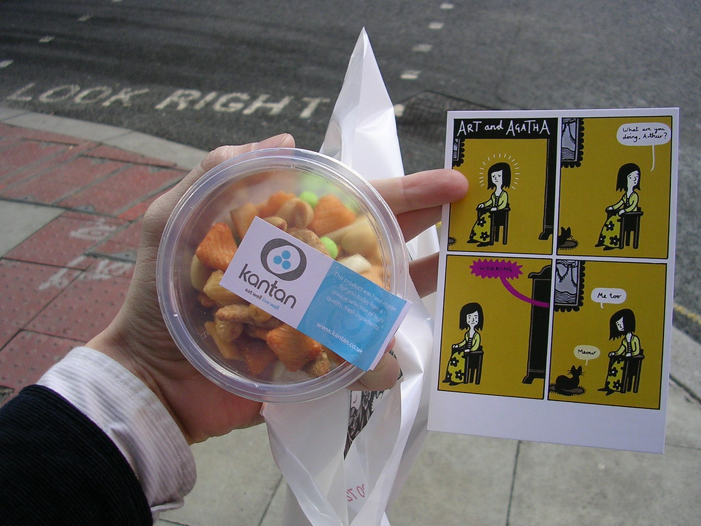

cada um tem suas pequenas manias quando viaja. Nas viagens por exemplo eu adoro perder tempo nos parques, ver como o pessoal da cidade curte suas horas de lazer. Por exemplo, dar comida aos esquilos. Sabe que nunca tinha dado comida a esquilos? é que nem dar a miquinhos, mas a versao hemisferio norte. Primeiro dia, toda a cidade e eu no parque st james vendo os animais e me lembrado da diferenca entre "jardins franceses" e "jardins ingleses"

E no ultimo dia, depois da ideo e com todo um british pela frente e eu parei numa loja de sushi. Sushi fusion. Fusion, um desses nomes que conhecia so de ler, nome in para uma cozinha contemporanea, globalizada no sentido criativo, que mistura culturas e cria novos sabores. Existe um restaurante na espanha que é especialista em criar novos sentidos na cozinha. Usa seringas, pipetas, canudos, espatulas, gelatinas e cria uma serie de mini esculturas, cubos coloridos, piramides transparentes, bolinhas, folhas superpostas, tudo para cirar novas texturas, novos cheiros e novos paladares. Essa sushi fusion era mais simples, tinha sushi de frango, e diversos outros aperitivos. Alguns pareciam interessantes outros repulsivos, mas a apresentação era muito bonita, como se fossem pequenos objetos de design em uma loja de decoracao. As placas as embalagens, as etiquetas com o preco em pounds. Adorei. Comprei um pacotinho barato de salgadinhos sortidos (mas nao o seu cheetos ordinarios, uma serie de formas cores e gostos -isso é peixe?) e sai rapidinho antes que batesse fome.

Na outra loja eu parei pelos aperitivos, mas os visuais. Uma livraria de revistas e livros de arte/design/arquiteura/quadrinhos etc. O cartao postal em questao é de uma serie chamada Art & Agatha, quadrinhos de um colorido sutil, de um desenho ingenuo e de um roteiro que nao conclui ou termina nada, que extrai graca do simplismo. Ela fala, anda, respira e voce sorri. Assim, so isso. enfim, pequenas distracoes. Comprei uma experiencia sensorial por 70 pences, e uma brincadeira visual por um pound e meio. nao é pra isso que vim pra ca?

: )

<figure>

</figure>
