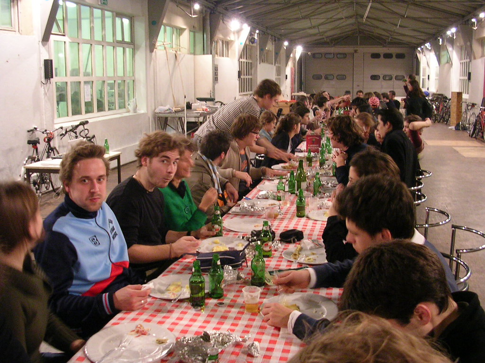

definitivamente essa minha universidade tem um que de unico que é inacreditavel. Agora, é um termo grego, aqui usado pra designar reuniao de alunos, assembleia da escola, onde todo mundo se reunie para discutir e escutar novas mudancas nas diretrizes da escola. Raclette é uma comida francesa, irma do fondue, provavelmente surgida em epocas duras: é queijo derretido, batata assada e presunto cru. Agoraclette foi a ideia que a direcao teve para atrair quorum para a plenaria. Uma longa, muito longa mesa de boca livre, com raclette (o nome do queijo), batata assada no papel aluminio e presunto cru ate voce nao aguentar mais. Nao para por ai: seguiu-se de doces, guloseimas, jacares de gelatina e distribuicao de kinder ovos (!!!!) . Mas distribuicao mesmo, do aluno pegando a da caixa e jogando pra multidao pegar no ar. E ainda depois, ja que estamos aqui reunidos por que nao extender botando um som depois de tirar a mesa (nesse ponto literalmente, por que a mesa nao devia ficar assim no meio do caminho da "cour". detalhe que nao pode ser esquecido. A ensci nao tem cozinha pra esse batalhao, a cantina tem dois microondas e olhe la. Aha, mas tem o atelier de maquete! Quantas vezes na sua vida voce encontra uma escola que assa batatas e derrete queijo na maquina de vacuum forming? :)))

<figure>

</figure>
