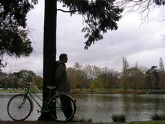

 
  [arvore de natal](http://www.flickr.com/photos/avsa/70227359/)  
 Originally uploaded by [Alexandre Van de Sande](http://www.flickr.com/people/avsa/). quando eu era pequeno em dezembro saia com paipai para catar galhos de 
 
pinheiros (na verdade aquelas arvores do recreio cujo nome me escapa). 
 
juntavamos em um vaso, abriamos as velhas caixas de decoracao do ano 
 
passado e tinhamos uma linda arvore de natal. Esse ano resolvi fazer o 
 
mesmo, mas com "arvores de natal de verdade". Fui ate o Bois de 
 
Vincennes com a intencao de cortar dois ou tres raminhos de "arvore de 
 
natal" e trazer de volta pra casa. 
 
 
 
Mas cade que? primeiro uma licao de botanica. Isso que nos, 
 
tropicalistas chamamos de pinheiros, desdobram-se em uma infinidades de 
 
arvores e arbusto cujas folhas espinhosas se associam automaticamente 
 
ao nosso consciente coletivo de bolas vermelhas e luzes piscantes. 
 
Algumas sao arvores frondosas, com folhas que ja vem coloridas estilo 
 
neve. outras sao arbustos medios em forma de cones, ou moitas menores, 
 
mas cujos galhos ja vem triangulares e com frutinhas vermelhas 
 
natalinas. A minha leiga definicao de 'pinheiro' nao vale xongas por 
 
aqui. 
 
 
 
E tem o cortar. Por que nos tempos de crianca, arvore é arvore e ta no 
 
meio da rua, em terreno baldio, descuidado. Cortar uns galhos baixos é 
 
até prestar favor a comunidade. O bois de vincennes de bosque nao tem 
 
nada e é um belo parque, com provavelmente um jardineiro pra cada cinco 
 
pedacos de grama. Tudo podado bonito, bem cuidado. Nenhum galho 
 
pendente pedindo socorro, nenhuma pilha de arbustos dizendo me leve. 
 
 
 
E tem os franceses, claro. Ao contrario da nossa cultura do "voce sabe 
 
com quem esta falando" que a tudo responde e a tudo briga, mesmo quando 
 
freia no transito 
 
liga-a-seta-estaciona-de-re-em-cima-de-um-canteiro-no-meio-da-hora-do- 
 
rush. Aqui nao, nao foi uma ou duas vezes que fui repreendido em 
 
publico por algo que o marlon estava fazendo. Ele subiu num banco do 
 
metro e logo alguem veio me dizer seriamente como aquilo estava errado 
 
por que podia quebrar o patrimonio do metro. Ele um dia jogou um papel 
 
num carro na rua, e este fez re, de 100 metros, pra dizer (a ele mas o 
 
recado era pra mim) como era perigoso jogar coisas em carros em 
 
movimento. Os franceses (dizem os europeus, mas nao posso falar) te 
 
olham de um jeito feio quando voce faz algo "errado" na rua. Nem que 
 
esse errado seja andar de bicicleta onde nem tem placa dizendo que nao 
 
pode. Num momento olhei uns belos tres quartos de hora para um arbusto 
 
apetitoso, frondoso, cheios de galhos que ninguem ia sentir falta. 
 
 
 
Mas os olhares dos franceses nao me deixaram. Essa é a tal educacao 
 
repressora dos europeus? 

<figure>

</figure>
