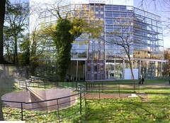

 
  [Fundacao Cartier](http://www.flickr.com/photos/avsa/72075725/)  
 Originally uploaded by [Alexandre Van de Sande](http://www.flickr.com/people/avsa/). Um desses predios modernistas modernos, onde eles substituiram o amor pelo concreto que o niemeyer tinha por um amor por um monte de aco. Mas o principio é o mesmo que os modernos queriam: uma caixa transparente, sem paredes, flutuando no centro da cidade. A maior parte deu nos nossos predios de escritorio enfeiando nosso ambiente urbano, onde a falta de paredes deu em um grande labirinto de baias. Volta e meia um acerta e faz um obra bonita dessas, onde de fora voce pode acompanhar as escadas, as pessoas, o céu atras. Quando voce quase se convence que poderia ser so um fio de arame invisivel entre voce e o céu. 
 
Essa foto eu tirei do lado de fora pois do lado de dentro nao permitiam, la dentro, é um questao de direito de copia. A questao dos direitos autorais é fascinante e complexa em parte pois toca tantos assuntos que é dificil alguem entende-la em sua totalidade. E por causa dessa complexidade de assuntos, normalmente é reduzida a uma questao especifica, em grande parte culpa dos radicais: tanto da parte das gravadoras americanas, que vem reduz tudo a qustao de defesa da propriedade deles contra jovens pirateando musica, um discurso que entra facil nos jornais, como da parte dos radicais jovens, que reduzem tudo a slogans e frases de efeitos, que se confundem com frases anarquistas, camisetas do che guevara e se misturam com um pouco de marxismo revolucionario a la anos 60. Um discurso que entra facil em foruns e listas de discussao adolescentes, mas que normalmente para no "nos, os bons, contra eles, os maus". 
 
Na fundacao cartier, a preocupacao de direito autoral era com a imagem das estatuas. De certa forma, tirar uma foto digital de uma obra é o mesmo processo de xerocar um livro de arte: pois no mundo digital tudo tornam-se copias. Em um museu antigo, a maior parte das obras esta em dominio publico, mas houveram casos de museus processando livros que infringiam o seu copyright por copiarem sem permissao a fotografia (com direitos autorais) de um quadro (dominio publico). A questao complica quando a obra em questao é uma estatua, pois é mais dificil separar a imagem da obra da obra em si. Portanto se voce tira uma foto de uma estatua, o direito de de permitir a copia dessa foto é do autor da foto ou da estatua. E quando voce faz um filme que utiliza uma cadeira, o designer da cadeira pode exigir uma comissao? Isso muda se o objeto em si for um predio? Se voce esta em area publica ou nao, isso faz diferenca? 
 
Boa parte desses problemas ja existiam quando a lei de direito autoral foi criada ha trezentos anos atras. Mas essas questoes se levantam agora pela proporcao: em um mundo digitl tudo é copia. Uso pessoal e publico, na internet se confundem. Toda comunicacao em um mundo digital de certa forma é uma reproducao nao autorizada, e o que antes era uma lei para restringir copias pode ser interpretada de forma a legalmente poder restringir essas outras areas. Basicamente é por isso que ha tantas batalhas: se pode haver duvida da relevancia ou da legalidade dessas questoes, um ponto fica claro: elas questoes totalmente diferentes daquela lei que, antigamente, so proibia voce de xerocar um livro de outra pessoa sem autorizacao. 
 
Enquanto isso, ha um certo temor da inseguranca no ar. Nem o museus, nem as gravadoras, nem todos os jovens de camisa de che copiando musica sabem ao certo o quanto e quem exatamente sai prejudicado ou se beneficia de ter sua imagem na internet. Ate por que no ritmo que a tecnologia evolui, ninguem sequer sabe ao certo o que é a internet. 
 
Enquanto isso os vigias das obras sao tolerantes: esperam que voce aperte o botao para depois lhe avisar que fotos sao proibidas. É so a primeira foto sair boa. 
 
E gostei do olhar cumplice que o vigia da mulher gigante na fundacao cartier, provavelmente estudante de arte, me deu quando disse: é, é questao de copyright. 

<figure>

</figure>
