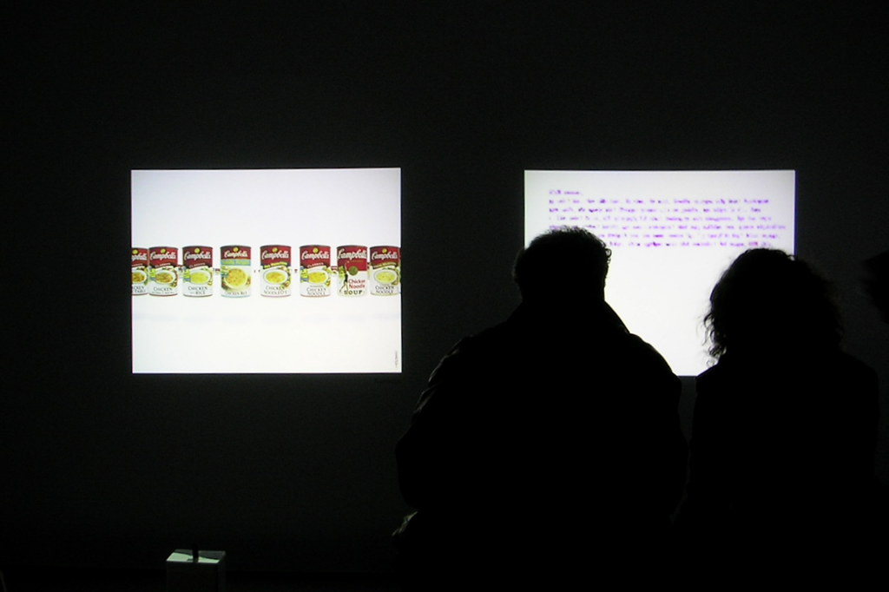

O outro artista na fundacao cartier era John Maeda professor do MIT com varios quadros digitais.

Uma vez eu comecei me imaginei como curador de uma exposicao, onde eu ia colocar uma galeria de computadores com o screen saver ligado. Mas longe e ser uma arte conceitual da humanidade "enquanto realidade de protetor de tela", mas por que eu havia visto alguns que mereciam posicao de destaque como obra de arte em si.

John maeda era um pouco isso, sete quadros digitais, que se movimentavam aleatoriamente, e outras sete interativas em uma sala branca, com os controles para as criancas.

Apesar de nao poder dizer que nao apreciei o trabalho tenho de admitir que sai meio decepcionado. Nenhuma das telas saia do formato retangular proposto pelo computador do John, e as "interfaces" ainda estavam todas no paradigma teclado ou mouse, no maximo um microfone. Como professor de interatividade do MIT esperava um pouco mais.

E as pinturas em si, nao eram tao esteticamente belas, e em momentos me dava a impressao que ele usava todas as possibilidades da paleta, ao inves de escolher algumas.

Ja vi diversos trabalhos online de artistas parecidos, alguns menos abstratos que o John. Quem se interessar que cheque o trabalho de uns Japoneses, como o "Futurismo Zugakousaku" (esse foi quem inspirou o primeiro comentario de screensavers) . ha outro que perdi o nome mas ei de reencontrar...

<figure>

</figure>
