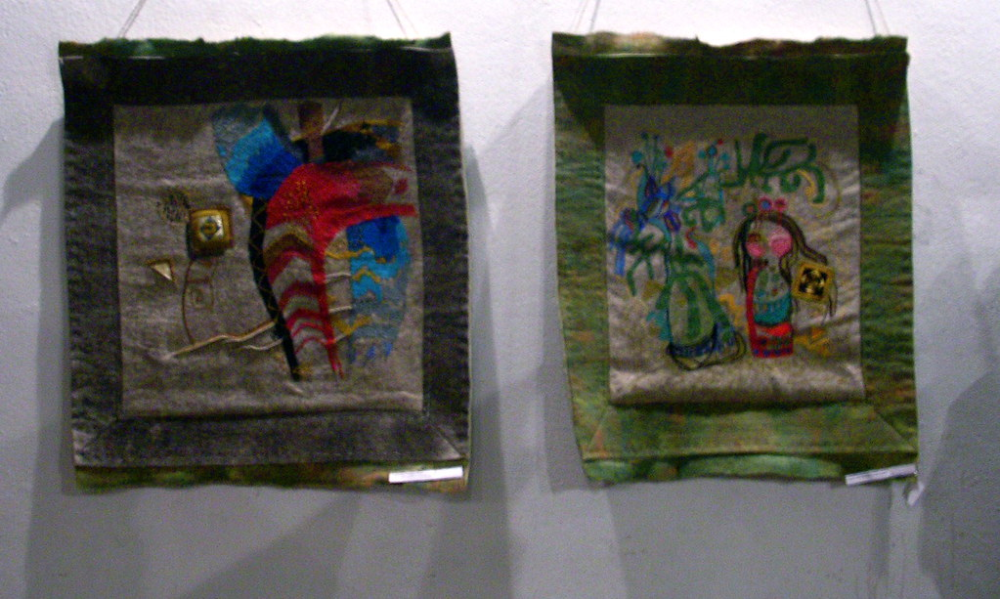

ok, volto ao assunto de coisas unicas que acontecem nessa universidade. Eis que ao chegar, em um sabado, para trabalhar no meu projeto encontro um grande yourt no meio do hall de recepcao. Um yourt para quem nao sabe (como eu ate hoje sabado de manha por exemplo) é a tenda tipica dos povos nomades das estepes da asia central. Estava rolando uma exposicao sobre esses paises, ou os seis istoes da asia central. Quem sabe dizer de cor? tente se lembrar antes de ler a proxima frase: Afeganistao, Turcomenistao, Casaquistão, uzbequistao, (vamos la, lembra dos outros?), Quirguistão e (esse é bom) Tajiquistão. Nao, paquistao nao conta.

Alem de musica e comida rolou um filmezinho de graca. O filme foi dos mais curiosos, chamava o anjo do ombro direito e se voce acha que vai ve-lo um dia pode parar de ler esse post.

O filho nem tao prodigo assim retorna a sua vila natal pois sua mae esta no leito de morte. Ao chegar, da logo uma reforma na casa e compra uma nova porta por que a atual nao passa o caixao. Eis que foi so um golpe da mae para ganhar uma porta nova e ela vai muito bem de saude. dialogo memoravel

-com licenca seu pai ainda faz portas

-nao senhor ele morreu, mas eu trabalho nisso ainda -eu comprei uma porta fazem dez anos. vim busca-la -ah certo meu pai me falou, perai vou busca-la

Eis que todo mundo na cidade é meio golpista e bandido e na verdade passaram a perna na velha tambem e descobrimos que tudo foi uma armacao para fazer o filho voltar pra cidade, consertar a porta e dali os credores pularem em cima da casa nova do rapaz. Determinado tempo alguem aparece entregando uma crianca dizendo:

-toma teu filho

-voce toma isso! e comeca a porradaria

entao o rapaz se afunda em problemas, tenta roubar o prefeito, so se dao mal. Certo momento a mae dele vai falar com o prefeito (que tb é o chefao dos mafiosos) tentar livrar a divida do filho , sugerindo que ela podia morrer passava a casa pro filho e ele voltava pra russia. -mas a senhora é jovem ainda tem muitos anos pra viver -quantos?

o prefeito levanta e pega um livro. abre e diz com naturalidade -sete -e sera que nao tem jeito de trocar meu lugar na fila? -mm talvez eu possa resolver isso

o prefeito pega um telefone vermelho e troca umas ideias com "a pessoa certa" -esta acertado, voce toca com minha mae que estava pra morrer faz tempo. Amanha ta bom pra voce?

Ha uma mulher no filme, enfermeira, que mantem uma relacao estranha com o personagem principal. Um momento quando ela cuida de suas feridas ele passa a mao na sua cintura. Ela se silencia e se esquiva (ja houve outra cena antes onde ele tentou ser mais agressivo e ela brigou e foi-se embora). Ela vai para um canto e no momento que achamos que ela vai-se embora ela faz algo inesperado: solta o cabelo, o gesto mais sensual que desponta em um filme duro desses. Entao, sem esbocar reacao ela vai para um canto, e em uma fotografia especialmente bonita, percebemos, somente por uma sombra palida em cima dele e por sugestao de sons, que ela parece se despir. Ele nao reage. No final, levanta-se, automatico e inexpressivo como ela e vai ate ela. A luz, a cortina, as sombras, tornam a cena de uma sensualidade interessante. O contexto, a inexpressividade, a ambiguidade das intencoes e o machismo da sociedade tornam-a cruel. Mas filtrando as minhas observacoes cretinas, é um filme gostoso e bonito, se um tanto lento e fala de uma cultura de dificil acesso para mim. Mas bonito sim.

<figure>

</figure>
