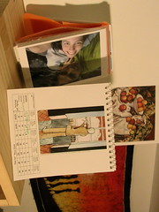

 
  [por que](http://www.flickr.com/photos/avsa/74762263/)  
 Originally uploaded by [Alexandre Van de Sande](http://www.flickr.com/people/avsa/). ela é sim uma otima companheira de momentos, por que sabe aproveitar os bons, sabe divertir os chatos, sabe sorrir nos meus tristes e principalmente, sabe encarar de forma simples e direta mesmo quando tudo vai mal. Elas sabe iluminar a cena com seus sorrisos, mas sem parecer exagerado. Ela sabe ser sempre, genuina, na dor ou na alegria. Ela tem sim, o sorriso mais iluminado que eu ja vi. Mas sabe, nao é por nada disso. 
 
É por que ela sabe dizer as coisas certas na hora que preciso. Ela sabe afugentar meus fantasmas quando tenho medo, me recuperando a mim mesmo. Ela sabe me dar coragem para fazer umas loucuras que ela sabe que tenho de. Eu gosto de dizer que acreidto que tudo é possivel, entrar e qualquer lugar, falar com qualquer um, conseguir qualquer numero de telefone, com um pouco de cara de pau, um pouco de sorte e um pouco de perseveranca. Mas nao é verdade, e varias vezes vc para no meio. Ela sabe me empurrar quando empaco, ela sabe, com a certeza de quem ja pulou no abismo sem um segundo de hesitacao, quando voce simplesmente tem de tentar. Com um "por que nao?" ela me faz pensar se é possivel oque ja tinha descartado, "por que nao ir ate la? por que nao fazer isso? vai la". 
 
Logo ela, que mais devia ter medo dos meus sonhos, que mais devia ter medo do que eu poderia me tornar no futuro. Logo ela, quem é a pessoa que mais arrisca a perder algo se eu conseguir o que todo mundo pensa que eu posso. Logo ela, mas nao: ela nunca me fez ir a lugar algum que nao fosse pra frente. Ela nunca me falou nada que nao me estimulasse a me tornar melhor, nunca botou pilha em nada que nao me tornasse mais eu mesmo, que nao fizesse brotar os meus sonhos. É por isso, exatamente por isso, voces entendem? 
 
Talvez ela nao saiba. Mas no fundo, essa é justamente a que faz com que eu seja intensamente, cada vez mais, sempre dela. 

<figure>

</figure>
