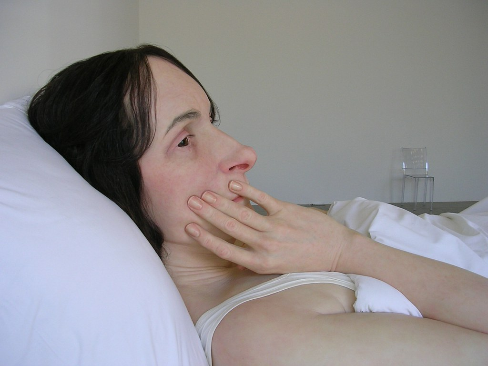

Eu tenho uma visao bem restrita da arte, onde os artistas sao reduzidos a cientistas, fazendo experiencias e descobertas, mas em uma area diferente.

Nos dias iniciais da computacao grafica, os engenheiros faziam softwares que reproduziam fielmente as leis da cinematica. Brilhos feitos pelo calculo de cada trajetoria de cada raio de luz, enquanto se dispersavam pelo ambiente. Ou, mais tarde, labios que se mexiam em perfeicao de acordo com cada fonema calculado. E os resultados eram sempre os mesmos:

pessimos. irrealsiticos, artificiais.

E entao eles voltavam para os calculos para saber o que nao correspondia a realidade. Ai veio um bando de animadores de uma empresa chamada pixar, que sabiam mais de animacao que de leis de fisica e criou uma animacao simples, fundo preto, camera estatica, quase somente objetos rigidos, onde duas luminarias corriam de um lado a outro. Os detalhes de timing, o movimento, aquela tremida que o braco vai pra tras logo antes de ir pra frente, aquela respiracao do movimento, esses detalhes tornaram a animacao tao realistica quanto todos os calculos precisos nao conseguiram. Essa foi a pixar.

Hoje o grande desafio parece ser por uma razao ou outr criar um androide que aja e interaja de forma realistica. Sao um grupo de cientistas com um budget muuito grande calculando os movimentos labiais de rostos de silicone. Os resultados sao piores que os dos engenheiros que falei antes, pois esses saem realisticos como zumbis semi mortos ou pessoas doentes. Sao quase humanos, mas o quase é tao amedrontador e artificial que joga por agua abaixo toda a possibilidade de nos sentirmos confortaveis com essas maquinas.

Arte hiperrealista nao é novidade, esta ai desde sempre. Mas as estatuas de Ron Mueck sao fascinantes, nao so pela riqueza de detalhes (cada pelo do braco, a porosidade da pele, sao detalhes que resistem ao olhar mais certeiro) mas tambem pelas expressoes. Nao sao, como os androides japoneses, modelos ideiais sorridentes, sao seres humanos pensativos, profundos, com uma preocupacao na cabeca, com filhos e uma historia a contar. Tem machucados, varizes, pele mole, gorduras extras, e nenhum sorria. Mas nenhum era hipocrita: estavam congelados em momentos totalmente pessoais.

Talvez o verdadeiro primeiro androide seja uma obra de arte, nao resultado de um laboratorio.

<figure>

</figure>
