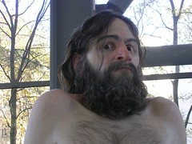

 
  [Ron Mueck - Wild man](http://www.flickr.com/photos/avsa/72075598/)  
 Originally uploaded by [Alexandre Van de Sande](http://www.flickr.com/people/avsa/). Toda obra de arte é feita de diversas camadas. As mais prfundas certamente contem significados que nem o proprio autor percebeu, a mais superficial é que nos faz sorrir, gostar, se emocionar ou minimamente se identificar quando vemos uma obra pela primeira vez, sem saber nada dela. Essa camada superficial, foi drasticamente alterada nos ultimos 150 anos, os primeiros artistas modernos nos tirando o vicio que essa camada precisava ser realistica, uma nova linguagem que o publico demorou geracoes a aceitar. Mas hoje quem nao ve a simples beleza das cores de um monet? 
 
Quem me conhece sabe que nao gosto de arte pos moderna, essa cujo auge foi nos anos 80. Voce sabe qual foi: pensa naquela caricatura do artista intelectual, que coloca uma garrafa de pepsi na sala, e a acompanha de um discurso sobre a "inconstancia da humanidade enquanto liquido". Identificou? Aquele que os criticos aplaudem, o sintelectuais escrevem e que fez voce nao ver gosto nenhum em nenhuma exposicao de arte dos ultimos dez-quinze anos? 
 
A proposta, era de certa forma criar uma arte cuja interpretacao vinha puramente da experiencia e da interpretacao de cada um. De certa forma, uma arte onde so haviam camadas profundas e significados importantes. Mas, como nao pode haver um objeto sem superficie, o maior crime desses artistas foi fazer uma arte sem essa camada superficial que toca o espectador e de alguma forma o chama a contemplacao, o convida a saber mais. Criaram uma arte que so era possivel aceitar se voce tinha lido os artigos certos, os livros corretos, ouvido os criticos que sabiam do que estavam falando, uma arte que, ao contrario do que eles queriam, so havia um significado possivel e esse raramente vinha da experiencia pessoal de quem ve, mas do que aprendiamos daqueles que tinham entendido a coisa. E finalmente, ao criar uma arte cujo discurso (muitas vezes nao ditos pelo artista) era mais importante que a execucao abriram caminho para um numero que jamais saberemos de cafajestes, que colocaram uma minhoca no palco e esperaram para ver se os trouxas intelectuais fisgavam a isca. 
 
Ou sinceramente, tenham sido esses os verdadeiros artistas: os que pregaram uma grande peca na gente, nos museus e nos criticos que escreveram os livros de arte sobre eles. 
 
Mas a arte pos moderna esta morta, e viva ela. E Ron Mueck faz uma arte que tem todas elas: a camada que fascina as criancas e de certa forma te toca. 

<figure>

</figure>
