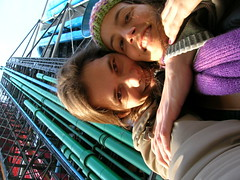

 
  [de volta a vida real](http://www.flickr.com/photos/avsa/83803063/)  
 Originally uploaded by [Alexandre Van de Sande](http://www.flickr.com/people/avsa/). acabei de ter os quinze dias mais magicos da minha vida. ainda estou 
 
reaterrisando entao desculpem pela demora em mandar mensagens a todos. 
 
vou contando tudo aos pouquinhos, por aqui,e tambem pelo 
 
flickr(http://www.flickr.com/photos/fernanda/) e fotolog 
 
(http://www.fotolog.com/amadorismo/) da fernanda que fiquei de cuidar 
 
um pouquinho. 
 
 
 
esse foi o segundo dia, quando passeamos no marais, no museu picasso e 
 
no pompidou. fiquei orgulhoso de poder dizer duas ou tres mais ou menos 
 
inteligentes coisas sobre arte nesses museus, oque talvez seja um 
 
indicativo de que aprendi alguma coisa afinal (nada que possa vender 
 
entretanto, para deixar o paulo feliz). As fotos do primeiro dia, onde 
 
fomos numa roda gigante na tuilleries e no senna, foram tragicamente 
 
perdida quando minha camera misteriosamente sumiu do bolso do meu 
 
casaco, ao sairmos de um metro lotado.. 

<figure>

</figure>
