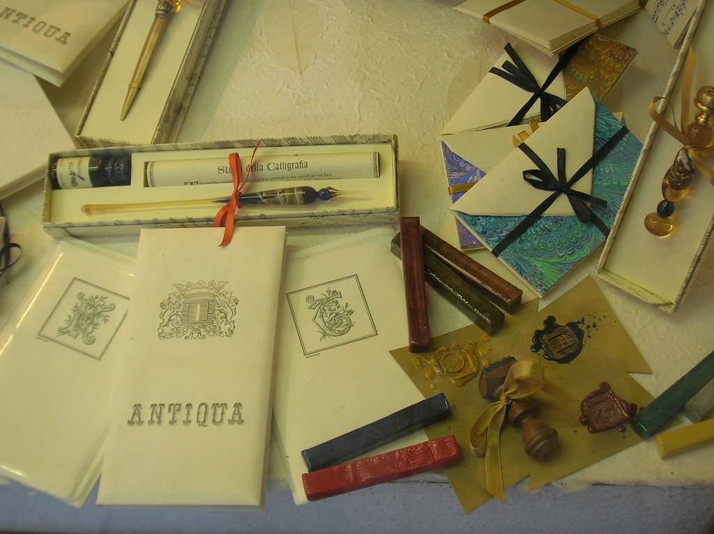

vi isso em roma, em veneza, na austria. Um kit completo, com carimbo cera vela e ate uma vinheta bonita com sua inicial para voce selar suas cartas com estilo. estilo medieval digo. eu pessoalmente curto esses revivals, ainda mais quando cartas vao desaparecendo e percebemos que realmente apos esse tempo todo uma carta de papel, selada a cera irreprodutivel é um desafio dificilimo para violadores de correspondencia. Abri-la impossivel e ler o conteudo tecnologicamante complicado. Usando a tinta de caneta certa voce certamente deve passar em branco por todos os testes radiologicos para detectar o conteudo... mas eu ainda acho mais bonito quando ha um toque moderno na antiguidade. Como por exemplo as camera digital em um corpo de camera dos anos 30 (por razoes nao somente esteticas, mas tecnicas) de um estudante da rca

(http://burnedmedia.com/scannerphotography.com/cameras/index.html) ou as intervencoes de diversos artistas colocando aparelhos modernos como mp3 players, bluetooth ou laptops em corpos de aparelhos de radio dos anos 70. hoje em dia a tecnologia nos permite tanta liberdade de formas que o objeto serve mais a comunicacao de sua funcao que propriamente a sua funcao. ou é a mesma coisa?

<figure>

</figure>
