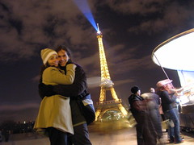

 
  [trocadero II](http://www.flickr.com/photos/avsa/87747604/)  
 Originally uploaded by [Alexandre Van de Sande](http://www.flickr.com/people/avsa/). pra que serve um bom tripezinho de fotografia? gosto do mundo borrado 
 
em volta da gente... 

<figure>

</figure>
