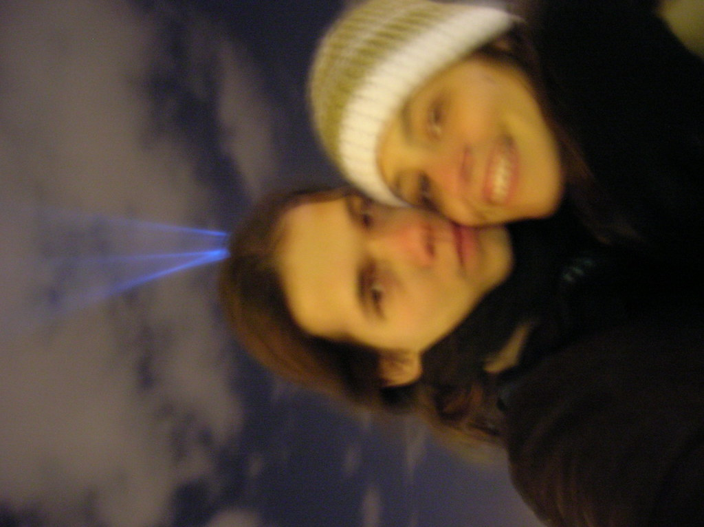

essa foto é do trocadero, ultimo dia antes de comecar a viagem. a luz esta centralizada na minha cabeca por que era eu que segurava a camera. acho divertida essa foto para saber o que era a luz veja na proxima foto.

<figure>

</figure>
