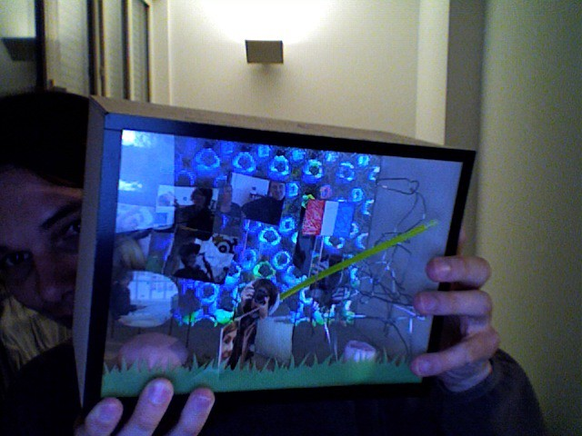

[as pessoas que entram quando voce abaixa a guarda](http://www.flickr.com/photos/avsa/107859361/) eu tentei assim que resolvi a questao computador adiar meu voo para omais rapido possivel. Nao consegui mas no fundo, foi melhor assim:voce tem de partir deixando as coisas bem resolvidas, se despedirdecentemente das pessoas que se importam que voce vai, mesmo que vocenem soubesse que tinham tantas assimsexta feira foi minha "evaluation" na ensci. Ate aquele momento pramim esse estava sendo um momento empurrado com a barriga por todomundo. as avaliacoes que tinha recebido dos professores de outrasmaterias tinham sido tao curtas, tao sucintas que tinha me sobrado umgosto amargo de no-fundo-ninguem-se-importa. Preparei uma apresentacaopowerpoint (melhor:Keynote(r)) curtinha e tinha como testemunhas umcolega da ensci, uma professora e a liz davis. Mostrei alguns dos meustrabalhos, algumas d eminhas fotos, falei o que andei fazendo naeuropa intra e extra-ensci, mostrei a minha evolucao nas ferramentas efoi bonito ve rque eles se interessavam, e nao era so uma formalidadede marcar nota no papel. Se emocionavam, mesmo com o video com tantotexto da viagem com a fernanda. Curtiram faziam perguntas e depois detodos terem ido embora continuamos conversando, eu e a Liz, um bompedaco de tempo, sobre europa, os franceses e sobre carreira. Elaparecia como alguem da minha familia na hora que nos dizemos tchau.A noite meus amigos da ensci me organizaram uma festinha, cujo convitequase se perdeu no meio de outros emails nao lidos no meio da confusaodo computador, em homenagem e minha partida, com direito a um mapa dafranca desenhado na mesa onde todo mundo ia trazendo uma comida de suacidade e marcando no mapa de onde vinha. Conversamos, rimos, jogamos.No final teve um bolo surpresa ao outro alexande que faziaaniversario. E depois, eles todos com cara de quems estao armandoqualquer coisa, quem recebeu a surpresa foi eu.Isso que esta na foto é um presente que eles fizeram especificamentepra ocasiao. Uma caixinha com diversas fotos do atelier que participeie das pessoas que nele estiveram, feita em madeira com tampinha deacrilico. A caixinha nao eh especialmente bonita ou superpratica paracolocar na mala, mas o que ela dizia pra mim foi tao legal que atei meenvergonhei. Dizia que enquanto eu estava me preparando pra ir emborao mais rapido possivel, achando que a escola ja tinha dado o que tinhaa dar, e que meus colegas ja tinham entrado em outra, esses colegasestavam se dando ao trabalho de me inventar uma lembrancinha. Gentecom quem nao falei tanto assim, com quem nao sai para beber, com quemnao fui a noitadas, mas gente com quem convivi, dei e ouvi conselhos,fiz piadas na aula e ajudei no trabalho. Gente que se importa.É verdade, talvez um professor nao seja uma pessoa pela qual passamtantas vidas na frente dele e ele nao guarda nada. Um dia quando eramais novo participei de um workshop da faber castell onde oresponsavel sorteou uns produtos no final. Ele queria que eu ganhasseum produto (talvez por que fosse o mais novo da turma) e vendo que naodeu certo na primeira tentou uma segunda, e essa tambem naofuncionando me chamou em um canto e me deu um conjunto delapis-pasteis secos que ate hoje guardo, como um dos tokens de "vai emfrente" mais bacanas que ja recebi.. Nunca esqueci desse sujeitoanonimo, so porque em um momento ele me deu um presente.Pois é, talvez a gente deixe mesmo uma marquinha nos lugares e emalgumas pessoas pela qual passamos. E isso é tao bonito..

<figure>

</figure>
