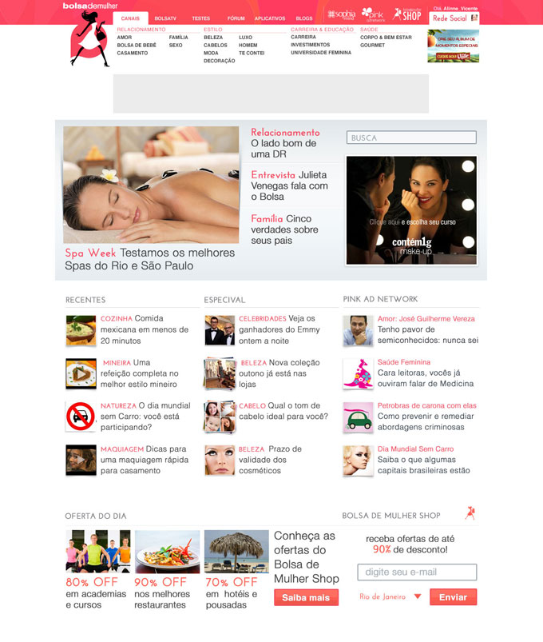
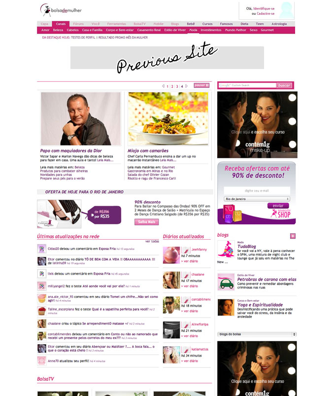
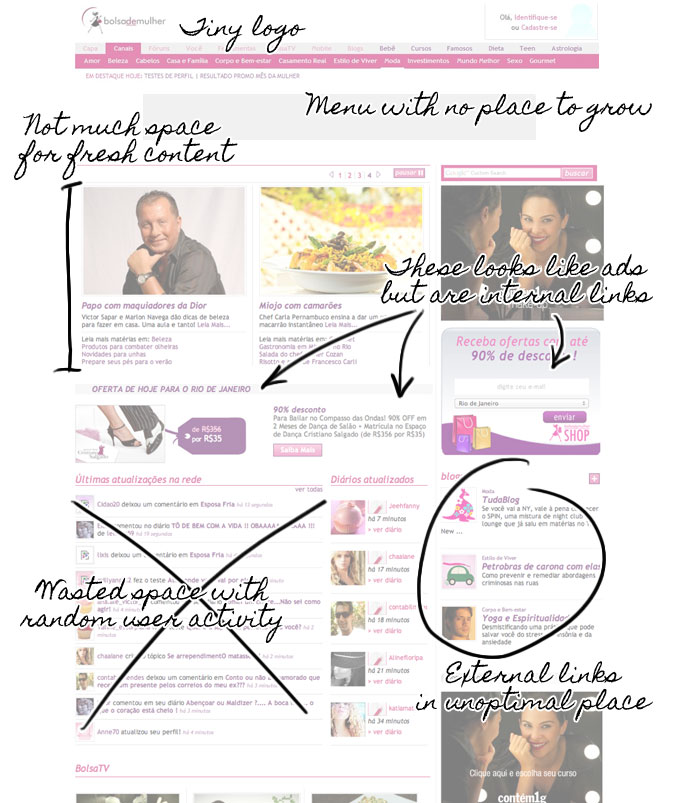
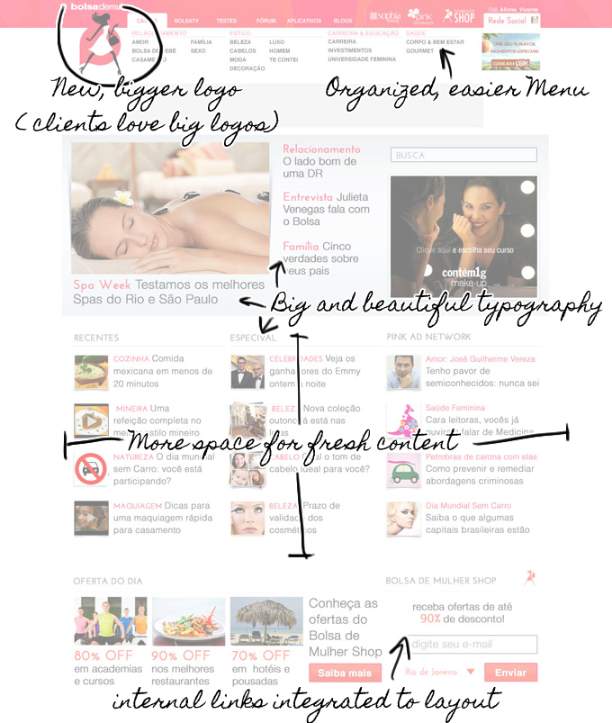

<figure>

</figure>

<figure>

</figure>

<figure>

</figure>

<figure>

</figure>

The biggest internet company focused Women was going through many renovations in 2011 and needed to reflect it on their home page. Our focus was to do a total revamp of the brand and site look, in short notice and but without needing a total rewrite of the complex and hard to maintain custom content management used. I was the leader of the team in charge of changing the main page.

In about four weeks we were able to using mostly CSS and the fewest possible infrastructure changes, create a total portal page, more modernized and showcasing the content the team produced.
