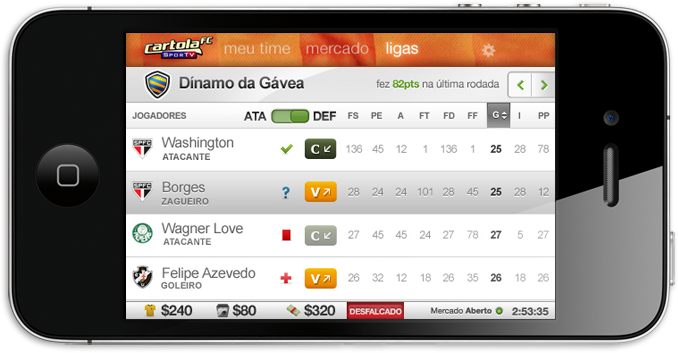
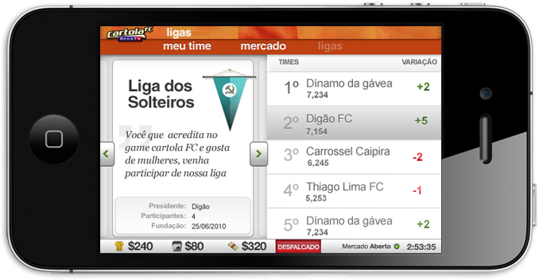
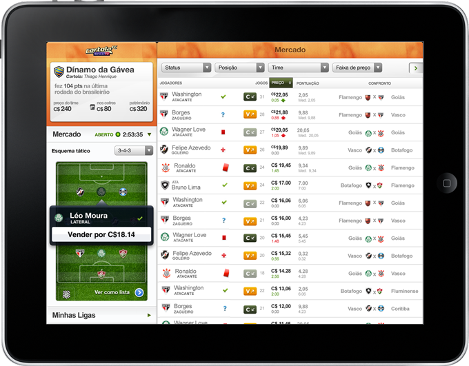

<figure>

</figure>

<figure>

</figure>

<figure>

</figure>

<figure>

</figure>

Cartola is a Fantasy Soccer game created by Globo.com where soccer fans can put their (virtual) money where their mouth is. Users create soccer leagues where they buy and sell real world Soccer players and see how well their investment pay when the price goes up and down related to their actual performance.

I was responsible to build the Visual interface to the iPhone and iPad port of what was originally a web-only game.

[**_Cartola_ in the AppStore**](http://itunes.apple.com/us/app/cartolafc-sportv/id390986079)
