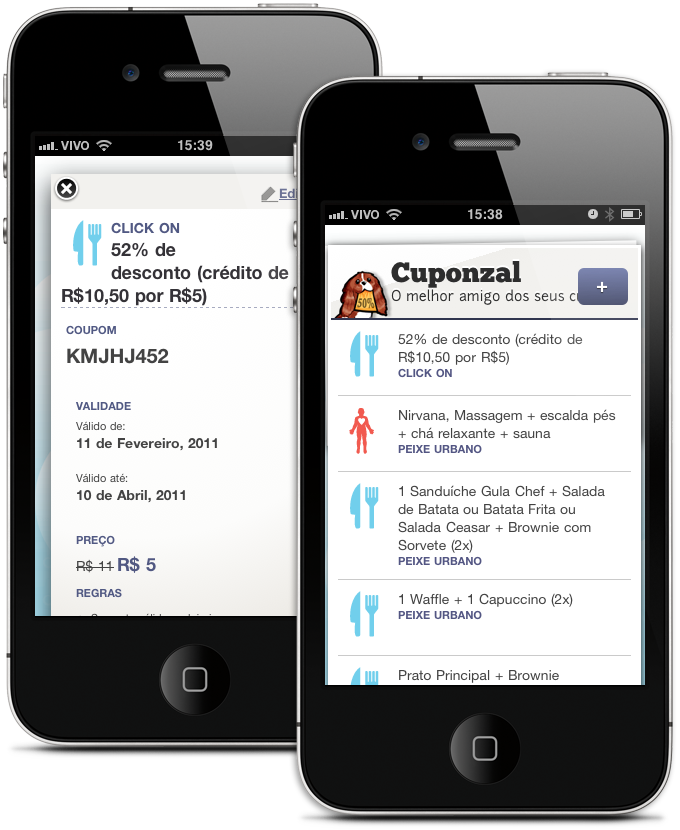
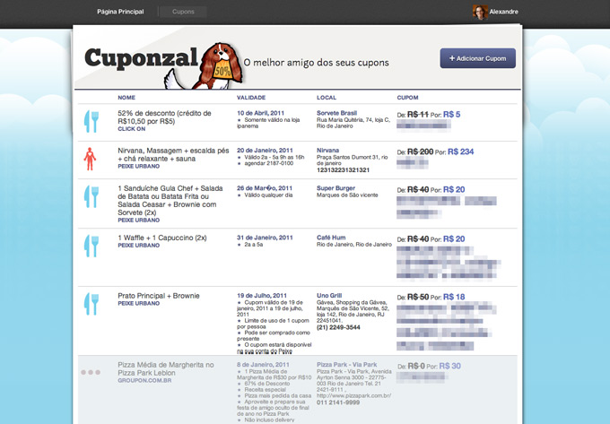
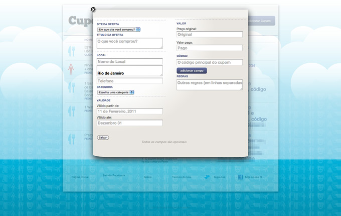

<figure>

</figure>

<figure>

</figure>

<figure>

</figure>

Site for collecting and organizing Deals from deal sites. In 2009-2010 deals sites became a gigantic craze in Brazil, earlier and in a much different way from it’s american counterpart. While in the US, the game was dominated by a few early players in Brazil there was a new Daily deals site created every other day.

Localized to small cities, to specific groups or very niche market at some point in 2010 there was more than 200 different sites using the same business model: selling coupon codes that could later be claimed for discounted items or service.

Instead of building another deals site we focused on building a service for people who used them: a central repository for your coupon codes, available anywhere you went, compatible for any device. The idea was to make it as easy to register a code as forwarding an email, and the site would take care of the rest, pinpointing the establishment on a map and alerting you by email when the deal was about to expire.

The site was built in the model of a responsive webapp, the same codebase and a changing CSS to adapt to any device screen size, allowing you to even run it full screen from your iPhone home screen.

[**Cuponzal**](http://cuponzal.com)
