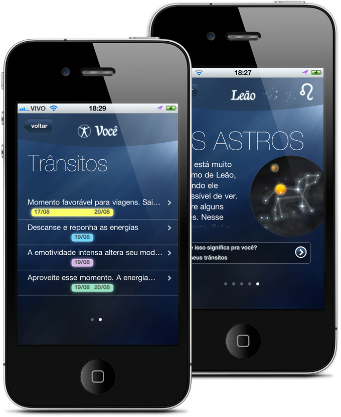
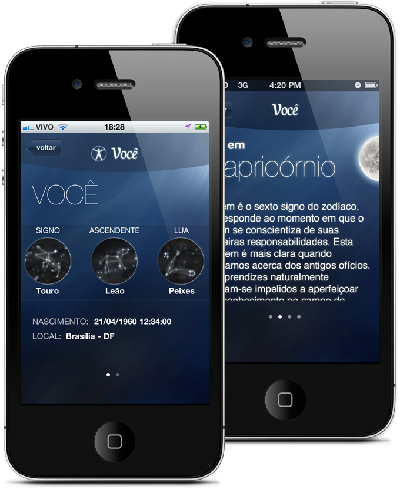

<figure>

</figure>

<figure>

</figure>

<figure>

</figure>

Understanding how things work is the essence of good design. I’m not personally a fan of Astrology but I do love astronomy and both are very closely related (and in some ways opposed).

By understanding how orbits actually work, I pushed the developing team to go beyond a simple horoscope app and bring real world content, using planetary data from Nasa’s website to build a small virtual Orrery in your phone. The app shows people not only information about their Astrological sign, but information about it’s related celestial constellation: where it is in the sky, how to look for it on the sky, what planets are in transit and what this means in the Astrological mythology.

Not only this makes for one of the most visually interesting Astrology software in the AppStore, but it also hopes to make people more interest in the sky above them, by connecting their spiritual symbols to their real world counterparts.

By undertanding how both Astrology and Astronomy correlates, we were able to create a rich and respectful Astrology App that differentiates itself from it’s competitors.

[**Estrela Guia in the AppStore**](http://itunes.apple.com/app/estrela-guia/id456625305)
