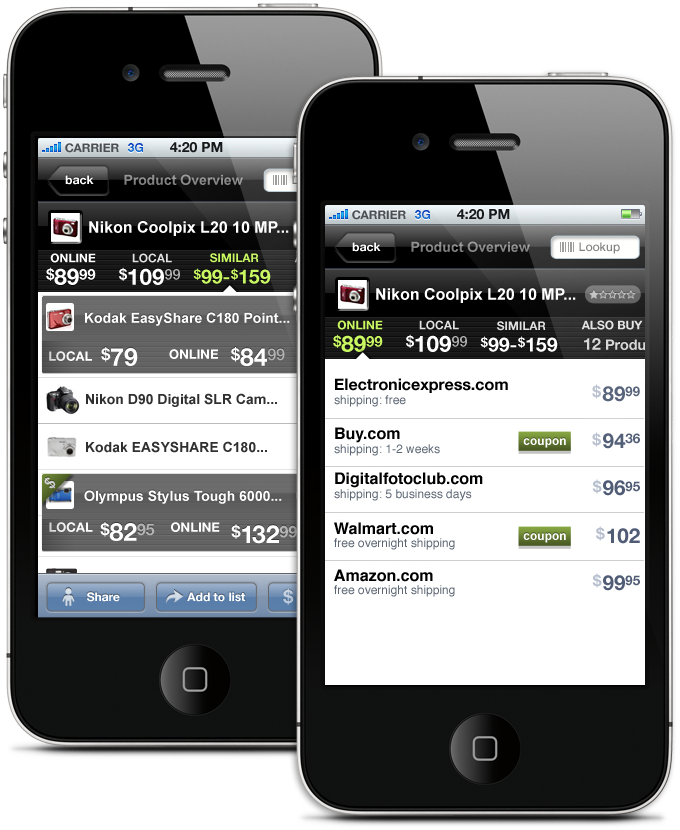
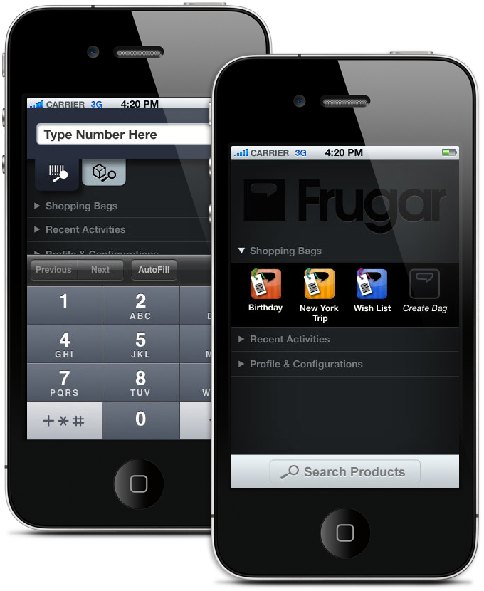
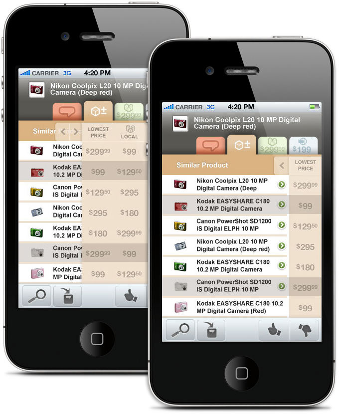
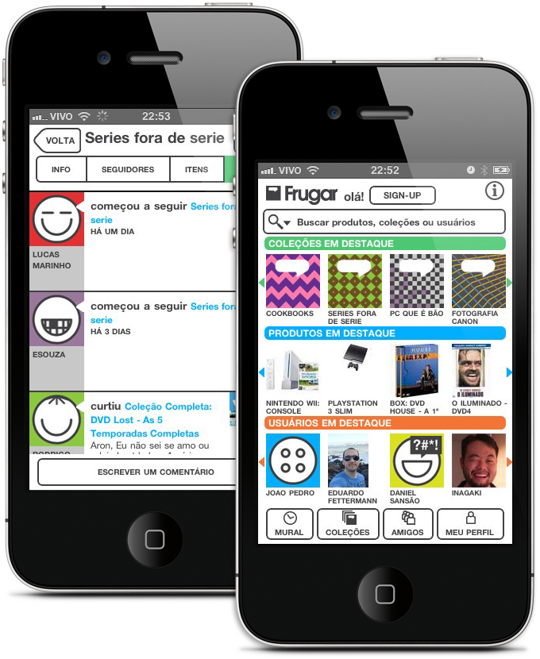

<figure>

</figure>

<figure>

</figure>

<figure>

</figure>

<figure>

</figure>

Frugar.com is currently a site for organizing lists of your favorite things – but it wasn’t always that. When I first came into the company it was intended to be a feature phone application for shoppers, which evolved into a barcode reading app for iPhone and into a social network for reviewing products.

I worked as both a Designer (in the earlier versions) and a web developer for Frugar, going through six pivots of the company, an intense learning experience of the inner workings of a startup company.

[**Frugar.com**](http://www.frugar.com)
