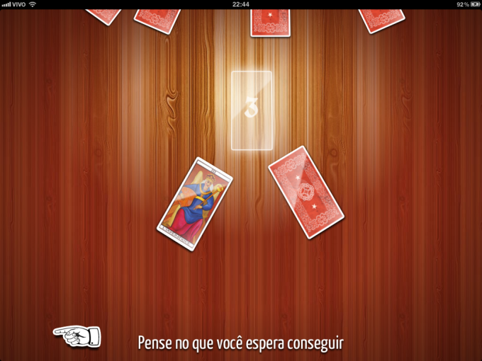
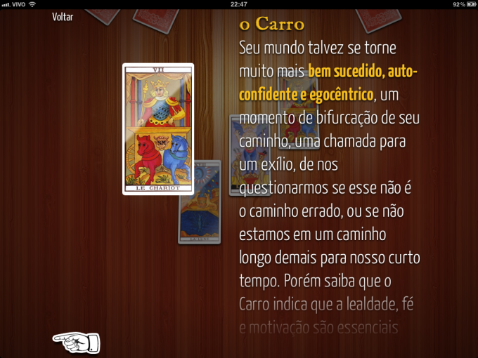
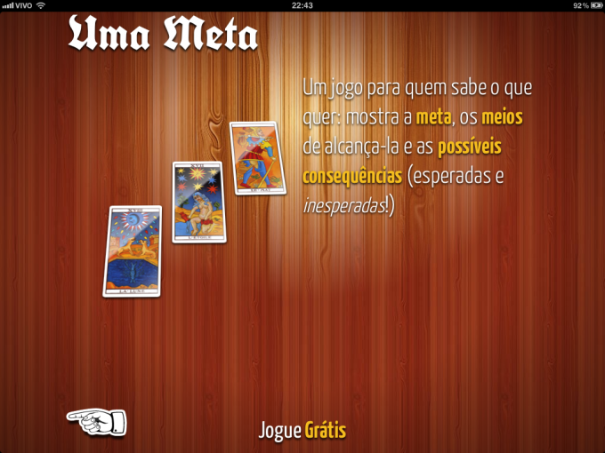
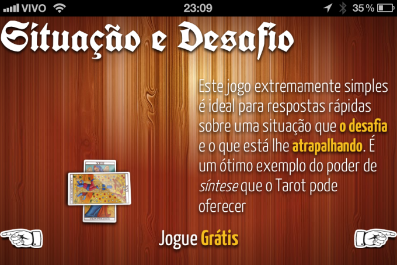
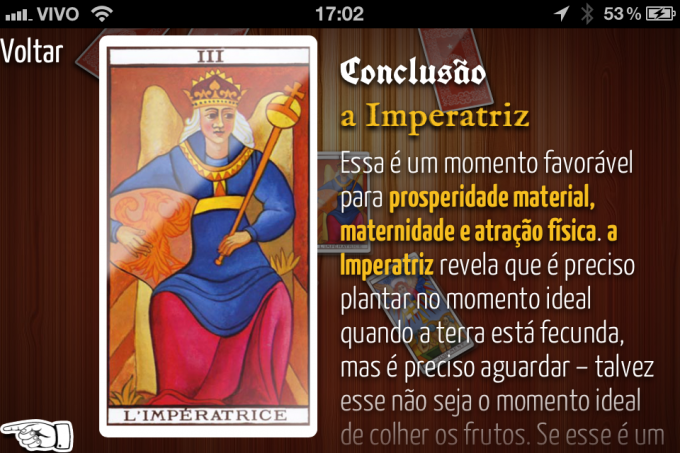
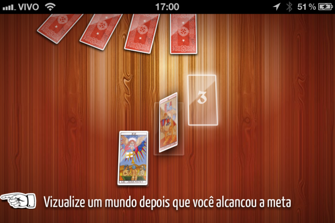

<figure>

</figure>

<figure>

</figure>

<figure>

</figure>

<figure>

</figure>

<figure>

</figure>

<figure>

</figure>

I’m a big believer in making things simply beautiful, that the correct line is a beatiful one.

Tarot isn’t more a divination game than making fridge magnet poetry, so when I decided to build a tarot app for iOS I tapped on that fountain. I created this app from scratch: from design, to code, to the interpretation algorithm and the subtle animated transitions from states.

#### [Download from the AppStore](http://itunes.apple.com/br/app/jogo-de-tarot/id478366176?mt=8)
