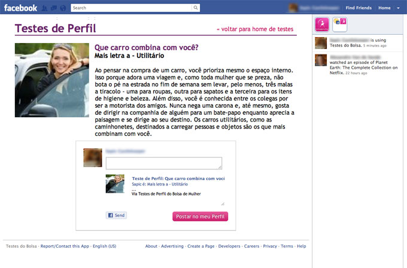

<figure>

</figure>

<figure>

</figure>

A Facebook app for fun profile games.

This is what I would call a “skunkworks” facebook game. The company was under a reestructuration so many of the design projects we were working wer canceled, new ideas were outright rejected because our IT was already too busy or because they had no short term revenues. This left our the design team with a lot of idle time. Instead of slacking off, I recruited them to make a facebook app, which would be a good opportunity for teaching them some HTML and CSS basics and a great opportunity for me to learn more about the facebook app development process. All coding was done inside the team, using our own servers.

At first when the project was launched and revealed to the company it got a lot of rolling eyes, because it could “take visitors away from the site and into facebook”. But not long after the company run into a problem that they had more ad contracts than space to deliver them, and the App fell like a glove. To this day, the app still works as a alternative revenue place, with special profile tests created for promoting books and product giveaways, and helping to bring more users to our company page.
